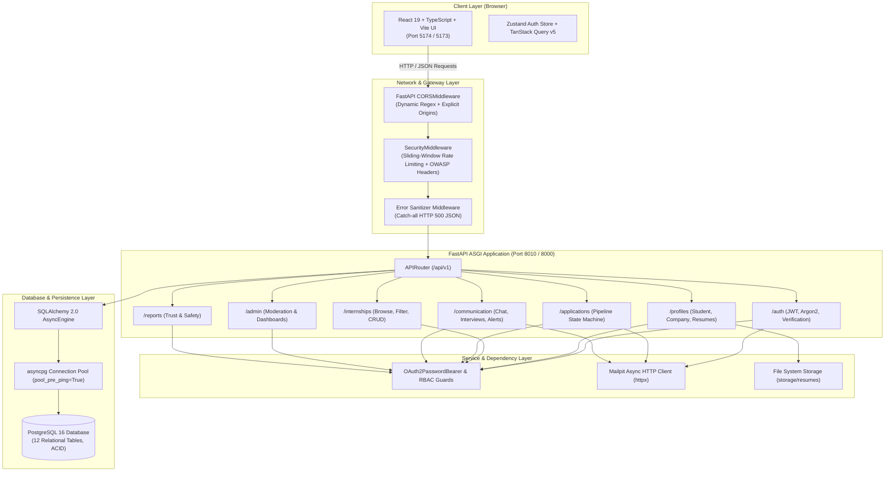

# Internship Connection Platform — Complete System & Backend Technical Reference Manual

> **Document Version:** 1.0.0  
> **Target Audience:** Engineering Team, System Architects, Full-Stack Developers  
> **Platform Scope:** LinkedIn-style Student-Company-Admin Internship & Talent Ecosystem

---

## Table of Contents

1. [System Overview & High-Level Architecture](#1-system-overview--high-level-architecture)
2. [Database Architecture & Data Models (DB Deep Dive)](#2-database-architecture--data-models-db-deep-dive)
3. [File-by-File Backend Codebase Breakdown](#3-file-by-file-backend-codebase-breakdown)
   - 3.1 [`requirements.txt`](#31-requirementstxt)
   - 3.2 [`backend/Dockerfile`](#32-backenddockerfile)
   - 3.3 [`backend/alembic.ini`](#33-backendalembicini) & [`backend/alembic/env.py`](#33-backendalembicenvpy)
   - 3.4 [`backend/alembic/versions/0001_auth_tables.py`](#34-backendalembicversions0001_auth_tablespy)
   - 3.5 [`backend/app/main.py`](#35-backendappmainpy)
   - 3.6 [`backend/app/core/config.py`](#36-backendappcoreconfigpy)
   - 3.7 [`backend/app/core/database.py`](#37-backendappcoredatabasepy)
   - 3.8 [`backend/app/core/security.py`](#38-backendappcoresecuritypy)
   - 3.9 [`backend/app/core/logging.py`](#39-backendappcoreloggingpy)
   - 3.10 [`backend/app/middleware/security.py`](#310-backendappmiddlewaresecuritypy)
   - 3.11 [`backend/app/middleware/errors.py`](#311-backendappmiddlewareerrorspy)
   - 3.12 [`backend/app/models/base.py`](#312-backendappmodelsbasepy) & [`user.py`](#312-backendappmodelsuserpy)
   - 3.13 Pydantic Schemas (`backend/app/schemas/*`)
   - 3.14 API Layer & Dependencies (`backend/app/api/v1/*`)
   - 3.15 Services & Utilities (`backend/app/services/mail.py`, `backend/app/seed.py`)
   - 3.16 PDF Extraction Engine (`backend/app/services/pdf.py`)
   - 3.17 AI Services & Matching Suite (`backend/app/services/ai.py`)
   - 3.18 AI API Endpoints (`backend/app/api/v1/ai.py`)
   - 3.19 Real-Time WebSockets & WebRTC Signaling (`backend/app/api/v1/ws.py`)
   - 3.20 College Placement Portal & TPO Analytics (`backend/app/api/v1/institution.py`)
   - 3.21 Backend Test Suite Architecture (`backend/tests/*`)
4. [Separately: Complete Imports & Suggested Alternatives Catalog](#4-separately-complete-imports--suggested-alternatives-catalog)
5. [Authentication, Authorization & Security Architecture](#5-authentication-authorization--security-architecture)
6. [API Endpoints Reference Matrix](#6-api-endpoints-reference-matrix)
7. [Frontend Connection & Deployment Guide](#7-frontend-connection--deployment-guide)

---

## 1. System Overview & High-Level Architecture

The **Internship Connection Platform** is an enterprise-grade, asynchronous web platform inspired by LinkedIn's professional connection paradigm. It connects three distinct actor roles:
- **Students**: Discover verified internships, submit multi-attribute applications with cover notes and uploaded resumes, track application status through a 7-stage state machine, participate in real-time direct messaging, and receive interview schedules.
- **Companies**: Register company profiles, create rich internship opportunities (remote/hybrid/onsite), review applicant pools, download applicant resumes, update statuses, schedule interviews (video/phone/in-person), and message candidates directly.
- **Admins**: Comprehensive control tower to verify company legitimacy, moderate internship postings (publish/reject/close), monitor system statistics, investigate user and listing reports, and suspend/reactivate accounts.

### Architectural Diagram



---

## 2. Database Architecture & Data Models (DB Deep Dive)

### 2.1 Database Technology Selection: PostgreSQL vs. MongoDB
The project uses **PostgreSQL 16** with the asynchronous **`asyncpg`** driver and **SQLAlchemy 2.0**.
- **Why PostgreSQL?**
  1. **Strict Relational Integrity**: Applications link Students, Companies, and Internships. Foreign keys with cascading rules (`cascade="all, delete-orphan"`) ensure that deleting a user or internship doesn't leave orphaned applications or resumes.
  2. **ACID Transactions**: State transitions (e.g. scheduling an interview changes `application.status` to `INTERVIEW_SCHEDULED` and creates an `interviews` row in one atomic transaction) cannot suffer partial writes.
  3. **Complex Aggregations & Joins**: Dashboards require joining applications, internships, and users to calculate pipeline stage counts, interview listings, and verified company lists.
- **Can MongoDB be used?**
  Yes. To use MongoDB instead, the ORM layer would be replaced with **Motor** (async MongoDB driver) or **Beanie** (an ODM based on Pydantic and Motor). Embeddings would be used for sub-documents (e.g., embedding messages within conversation documents), though multi-document transactions would be required for application status transitions.

### 2.2 Relational Entity Relationship (ER) Schema

The database consists of **12 core relational tables**:

| Table Name | Primary Key | Foreign Keys | Key Columns | Indexes & Constraints |
| :--- | :--- | :--- | :--- | :--- |
| `users` | `id` (int) | None | `email`, `password_hash`, `role` (enum), `is_active`, `is_verified`, `suspended_at`, `verification_token`, `reset_token` | Unique: `email`, `verification_token`, `reset_token`. Indexes: `email`, `role`. |
| `student_profiles` | `id` (int) | `user_id` -> `users.id` | `full_name`, `university`, `major`, `graduation_year`, `bio`, `skills` | Unique index on `user_id` (1-to-1 with User). |
| `company_profiles` | `id` (int) | `user_id` -> `users.id` | `company_name`, `industry`, `website`, `description`, `verification_status` | Unique index on `user_id`. Default `verification_status='PENDING'`. |
| `refresh_tokens` | `id` (int) | `user_id` -> `users.id` | `jti` (UUID), `expires_at`, `revoked_at` | Unique index on `jti`. Index on `user_id`. Enables token revocation. |
| `internships` | `id` (int) | `company_id` -> `users.id` | `title`, `description`, `location`, `industry`, `duration_months`, `stipend`, `work_mode`, `skills`, `deadline`, `status` | Indexes: `company_id`, `status`. Statuses: `DRAFT`, `PENDING_APPROVAL`, `PUBLISHED`, `CLOSED`, `REJECTED`. |
| `applications` | `id` (int) | `internship_id` -> `internships.id`, `student_id` -> `users.id` | `status`, `cover_note`, `created_at`, `updated_at` | Indexes: `internship_id`, `student_id`, `status`. Prevents duplicate applications. |
| `resumes` | `id` (int) | `student_id` -> `users.id` | `original_filename`, `stored_filename` (UUID), `content_type`, `file_size` | Unique: `student_id` (1 resume per student), `stored_filename`. |
| `conversations` | `id` (int) | `student_id` -> `users.id`, `company_id` -> `users.id` | `created_at` | Indexes: `student_id`, `company_id`. Represents direct message channels. |
| `messages` | `id` (int) | `conversation_id` -> `conversations.id`, `sender_id` -> `users.id` | `body`, `created_at`, `read_at` | Indexes: `conversation_id`, `sender_id`. Read receipts tracking. |
| `interviews` | `id` (int) | `application_id` -> `applications.id`, `scheduled_by` -> `users.id` | `scheduled_at`, `interview_type`, `meeting_link`, `notes`, `status` | Index: `application_id`. Types: `VIDEO`, `PHONE`, `IN_PERSON`. |
| `notifications` | `id` (int) | `user_id` -> `users.id` | `notification_type`, `title`, `body`, `created_at`, `read_at` | Index: `user_id`. In-app notifications feed. |
| `reports` | `id` (int) | `reporter_id` -> `users.id`, `reported_user_id` -> `users.id`, `internship_id` -> `internships.id` | `reason`, `status`, `resolution_notes`, `created_at`, `updated_at` | Indexes: `reporter_id`, `status`. Statuses: `OPEN`, `INVESTIGATING`, `RESOLVED`. |

---

## 3. File-by-File Backend Codebase Breakdown

Every Python file in `backend/app/` is documented below with its **exact imports**, **why they were chosen**, and **internal mechanics**.

---

### 3.1 `requirements.txt`
Specifies pinned top-level production dependencies:
- `fastapi==0.116.1`: Modern, fast web framework built on Starlette and Pydantic.
- `uvicorn[standard]==0.35.0`: High-performance ASGI server with Cython dependencies (uvloop, httptools).
- `sqlalchemy[asyncio]==2.0.43`: Async ORM with complete 2.0 type hints and SQL expression language.
- `asyncpg==0.30.0`: High-speed native async C-extension PostgreSQL driver.
- `aiosqlite==0.21.0`: Async SQLite driver utilized for rapid, zero-dependency unit tests in isolated memory.
- `alembic==1.16.5`: Database schema migration tool configured for SQLAlchemy models.
- `pydantic[email]==2.8.2`: Data validation and serialization using Rust-based Pydantic Core with email-validator.
- `pydantic-settings==2.10.1`: Environment variables management loaded from `.env` files into typed objects.
- `python-jose[cryptography]==3.5.0`: JWT token generation, encoding, and decoding with cryptographic signatures.
- `argon2-cffi==25.1.0`: Winner of the Password Hashing Competition (PHC); Argon2id hashing algorithms.
- `python-multipart==0.0.20`: Streaming parser for handling file uploads (resumes) and multipart forms.
- `httpx==0.28.1`: Next-generation asynchronous HTTP client for contacting external services (Mailpit).
- `pytest==8.4.1`: Test discovery and execution framework.

---

### 3.2 `backend/Dockerfile`
- Multi-stage lightweight `python:3.12-slim` container.
- Installs `requirements.txt` without caching wheels (`--no-cache-dir`) to keep images small (<150MB).
- Exposes port `8000`.
- Launches via `uvicorn app.main:app --host 0.0.0.0 --port 8000`.

---

### 3.3 `backend/alembic.ini` & `backend/alembic/env.py`
- **Imports in `env.py`**:
  - `asyncio`: To run the asynchronous migration loop with `create_async_engine`.
  - `logging.config.fileConfig`: Reads logging configuration from `alembic.ini`.
  - `alembic.context`: Interacts with the Alembic migration runtime (running migrations, configuring database targets).
  - `sqlalchemy.engine.Connection`: Represents an active DB connection.
  - `app.core.config.get_settings`: Retrieves the dynamic `database_url` from application settings so migrations always target the correct database.
  - `app.models.base.Base`: Provides `target_metadata = Base.metadata`, allowing Alembic autogenerate to compare schema state against model classes.

---

### 3.4 `backend/alembic/versions/0001_auth_tables.py`
Initial migration creating the entire schema:
- **Imports**:
  - `alembic.op`: Provides DDL operations (`op.create_table`, `op.create_index`, `op.drop_table`).
  - `sqlalchemy as sa`: Declares column types (`sa.Integer`, `sa.String`, `sa.DateTime(timezone=True)`, `sa.ForeignKey`).
- **Logic**: Defines `upgrade()` which creates all 12 tables in proper dependency order and `downgrade()` which rolls them back cleanly.

---

### 3.5 `backend/app/main.py`
The ASGI root entrypoint configuring the server pipeline:
- **Imports**:
  - `fastapi.FastAPI`: Application container.
  - `fastapi.middleware.cors.CORSMiddleware`: Cross-Origin Resource Sharing handler.
  - `starlette.exceptions.HTTPException`: Base exception class.
  - `app.api.v1.router.api_router`: Aggregated API routes under `/api/v1`.
  - `app.core.config.get_settings`: Application settings for frontend origin URL.
  - `app.core.logging.configure_logging`: Sets JSON logging format for stdout.
  - `app.middleware.errors.unhandled_exception_handler`: Global 500 error sanitization.
  - `app.middleware.security.SecurityMiddleware`: Custom rate limiting and HTTP security headers.
- **Key Features**:
  - Adds `CORSMiddleware` with `allow_origin_regex=r"^https?://(localhost|127\.0\.0\.1|192\.168\.\d+\.\d+|10\.\d+\.\d+\.\d+)(:\d+)?$"` to prevent cross-port CORS blocks between frontend port 5173/5174/5175 and backend port 8000/8010.
  - Mounts `SecurityMiddleware` and sets custom exception handlers.

---

### 3.6 `backend/app/core/config.py`
Centralized typed configuration using Pydantic Settings:
- **Imports**:
  - `functools.lru_cache`: Caches `get_settings()` so `.env` is parsed only once.
  - `pydantic_settings.BaseSettings`, `SettingsConfigDict`: Parses and casts environment variables.
- **Settings Fields**:
  - `database_url`: PostgreSQL async connection URI.
  - `secret_key`: HMAC-SHA256 signing key for JWT tokens.
  - `frontend_url`: Base URL of the frontend web application.
  - `access_token_expire_minutes` (30), `refresh_token_expire_days` (7).
  - `mailpit_host`, `mailpit_port`: SMTP / API coordinates for transactional emails.
  - `max_resume_size_mb` (5), `resume_storage_path` ("storage/resumes").
  - `rate_limit_requests` (120), `rate_limit_window_seconds` (60).
  - `admin_signup_key`: Secret bootstrap key for admin registrations.
  - `gemini_api_key`: Optional API key for Google Gemini / generative AI services.

---

### 3.7 `backend/app/core/database.py`
Async database engine and session dependency provider:
- **Imports**:
  - `collections.abc.AsyncGenerator`: Typing for asynchronous generator functions.
  - `sqlalchemy.ext.asyncio.AsyncSession`, `async_sessionmaker`, `create_async_engine`: SQLAlchemy async core.
  - `app.core.config.get_settings`: Supplies `database_url`.
- **Functions**:
  - `engine = create_async_engine(..., pool_pre_ping=True)`: Pre-pings pooled connections to prevent broken socket exceptions after idle periods.
  - `get_db() -> AsyncGenerator[AsyncSession, None]`: Context-managed session generator yielding transactions to endpoint dependencies and auto-closing them when requests finish.

---

### 3.8 `backend/app/core/security.py`
Cryptographic primitives, password hashing, and token operations:
- **Imports**:
  - `datetime.datetime`, `timedelta`, `timezone`: Precise UTC timestamp calculations.
  - `uuid.uuid4`: Generates unique `jti` (JWT ID) claims for refresh tokens.
  - `argon2.PasswordHasher`: Argon2id password hashing engine.
  - `jose.jwt`, `jose.JWTError`: Encodes and decodes signed JWT claims.
  - `app.core.config.get_settings`: Retrieves HMAC secret key.
- **Key Functions**:
  - `hash_password(password: str) -> str`: Hashes passwords using Argon2id.
  - `verify_password(password: str, password_hash: str) -> bool`: Constant-time verification preventing timing attacks.
  - `create_token(subject, role, token_type, expires_delta) -> str`: Generates HS256-signed JWTs containing subject ID, role, type, and expiration timestamps.
  - `decode_token(token: str) -> dict`: Validates signature, structure, and expiration; raises `ValueError` on failure.

---

### 3.9 `backend/app/core/logging.py`
Structured JSON logging for cloud observability:
- **Imports**:
  - `json`: Serializes log dictionaries into single-line JSON records.
  - `logging`: Python standard logging framework.
  - `sys`: Writes logs to `sys.stdout` (standard for 12-factor container applications).
- **Classes**:
  - `JsonFormatter`: Formats records into `{"level": ..., "logger": ..., "message": ..., "time": ...}`.

---

### 3.10 `backend/app/middleware/security.py`
In-flight request guard and HTTP security headers:
- **Imports**:
  - `time`: Monotonic time source (`time.monotonic()`) immune to system clock drift.
  - `collections.defaultdict`, `collections.deque`: Sliding-window double-ended queue tracking timestamps per client IP.
  - `fastapi.Request`: ASGI request object.
  - `starlette.middleware.base.BaseHTTPMiddleware`: Base class for ASGI middleware.
  - `starlette.responses.JSONResponse`: Constructs HTTP 429 responses on rate-limit violations.
  - `app.core.config.get_settings`: Retrieves window size and limits.
- **Security Headers Injected**:
  - `X-Content-Type-Options: nosniff`: Prevents MIME-sniffing exploits.
  - `X-Frame-Options: DENY`: Prevents clickjacking in iframes.
  - `Referrer-Policy: strict-origin-when-cross-origin`: Controls leakage of origin in HTTP headers.
  - `Content-Security-Policy: default-src 'self'`: Restricts unauthorized script execution.

---

### 3.11 `backend/app/middleware/errors.py`
Global unhandled exception interceptor:
- **Imports**:
  - `logging`: Records full stack traces to server logs for debugging.
  - `fastapi.Request`, `fastapi.responses.JSONResponse`: ASGI interfaces.
- **Function**:
  - `unhandled_exception_handler(request, exc)`: Intercepts raw unhandled Python exceptions and returns a sanitized JSON response `{"detail": "Internal server error"}` with HTTP 500 status code, hiding internal SQL queries, file paths, and database topology from attackers.

---

### 3.12 `backend/app/models/base.py` & `user.py`
SQLAlchemy 2.0 Declarative ORM entities:
- **Imports**:
  - `datetime.date`, `datetime`, `timezone`: Python temporal types.
  - `enum.StrEnum`: Native Python 3.11+ string-backed enum (`UserRole.STUDENT`, `COMPANY`, `ADMIN`).
  - `sqlalchemy`: Column types (`Boolean`, `DateTime`, `Enum`, `ForeignKey`, `Integer`, `String`, `Text`).
  - `sqlalchemy.orm.Mapped`, `mapped_column`, `relationship`: Type-safe Declarative 2.0 mapping constructs.
- **Entities**:
  - `User`: Primary credentials, role, status flags (`is_active`, `is_verified`), tokens, relationships.
  - `StudentProfile`: Educational attributes, biography, and comma-separated skills.
  - `CompanyProfile`: Corporate identity, industry classification, website, and verification state.
  - `RefreshToken`: Trackable cryptographic session records for token revocation.
  - `Internship`: Job openings with duration, stipend, work mode, skills, and deadlines.
  - `Application`: Association object with 7-state lifecycle tracking students applying to internships.
  - `Resume`: Storage reference with file size, original filename, and MIME type.
  - `Conversation` & `Message`: Real-time chat messages between students and company recruiters.
  - `Interview`: Meeting schedules with link, notes, and status (`SCHEDULED`, `COMPLETED`, `CANCELLED`).
  - `Notification`: In-app event alerts.
  - `Report`: Moderation flags submitted against users or job postings.

---

### 3.13 Pydantic Schemas (`backend/app/schemas/*`)
Provides runtime input validation, type coercion, and OpenAPI JSON serialization:
- **`auth.py`**:
  - `StudentRegister`, `CompanyRegister`, `AdminRegister`: Registration payloads with strict `min_length`, graduation year range (`ge=2000, le=2100`), and `EmailStr` format validation.
  - `LoginRequest`, `TokenResponse`, `RefreshRequest`, `LogoutRequest`.
  - `CheckEmailRequest`: Pre-signup real-time email existence check.
  - `UserResponse`: Returns public user data without password hashes.
- **`profile.py`**:
  - `StudentProfileUpdate`, `CompanyProfileUpdate`: Edit forms for profiles.
  - `ProfileResponse`: Unified polymorphic profile representation.
  - `ResumeResponse`: Resume metadata (ID, original name, content type, size).
- **`internship.py`**:
  - `InternshipInput`: Validates title, description, location, duration (1-36 months), stipend (>=0), work mode (`REMOTE`/`HYBRID`/`ONSITE`), skills list, and deadline date.
  - `InternshipResponse`, `InternshipPage`: Paginated response structure (`items`, `page`, `page_size`, `total`).
- **`application.py`**:
  - `ApplicationCreate`, `ApplicationStatusUpdate`, `ApplicationResponse`, `ApplicationDashboard`.
- **`communication.py`**:
  - `ConversationCreate`, `MessageCreate` (body 1-5000 chars), `MessageResponse`.
  - `InterviewCreate`, `InterviewUpdate`, `InterviewResponse`.
  - `NotificationResponse`.
- **`admin.py`**:
  - `UserAdminResponse`, `ModerationStatus` (`PUBLISHED`, `VERIFIED`, `REJECTED`, `CLOSED`).
  - `ReportCreate`, `ReportUpdate`, `ReportResponse`.

---

### 3.14 API Layer & Dependencies (`backend/app/api/v1/*`)
- **`dependencies.py`**:
  - `oauth2_scheme = OAuth2PasswordBearer(tokenUrl="/api/v1/auth/login")`: OpenAPI-compliant bearer token extractor.
  - `get_current_user`: Validates JWT signature, checks `type == 'access'`, queries DB for active user.
  - `get_current_user_optional`: Allows unauthenticated public browsing while identifying logged-in users for personalized features.
  - `require_roles(*roles)`: Higher-order dependency returning 403 Forbidden if the caller's role is not authorized.
- **`auth.py`**:
  - Implements registration pipelines with automatic background email dispatch (`BackgroundTasks`).
  - Issues paired access (30m) and refresh (7d) tokens, recording refresh token JTIs in PostgreSQL.
  - Real-time pre-signup `/check-email` endpoint.
  - Full verification and password reset loop.
- **`profiles.py`**:
  - Full CRUD for student and company profiles.
  - Resume upload with MIME validation (`application/pdf`, `msword`, `docx`), size checks (max 5MB), and randomized UUID filenames.
  - Granular access control: Only the resume owner or a company with an active application from that student can download resumes.
- **`internships.py`**:
  - Public paginated search with dynamic filters (location, industry, duration, stipend ranges, work mode, skills matching via SQL `ilike`, deadlines).
  - Lifecycle state transitions (`DRAFT` -> `PENDING_APPROVAL` -> `PUBLISHED` -> `CLOSED`).
- **`applications.py`**:
  - Submits applications, prevents duplicates via unique constraints.
  - Strict status transitions: `APPLIED` -> `UNDER_REVIEW` -> `SHORTLISTED` -> `INTERVIEW_SCHEDULED` -> `SELECTED` / `REJECTED` / `WITHDRAWN`.
  - Dispatches email alerts to students when companies update application status.
- **`communication.py`**:
  - Direct message conversations between students and companies.
  - Automatic unread-message status update (`read_at = now()`) when fetching chat logs.
  - Interview scheduling, updates, and automatic notifications.
- **`admin.py`**:
  - Dashboard analytics (user counts, pending company verifications, unapproved internships, open reports).
  - Company verification review (`VERIFIED` / `REJECTED`).
  - Internship moderation queue.
  - User suspension & reactivation.
  - Report investigation.
- **`reports.py`**:
  - Allows authenticated users to report malicious activity, spam, or scam internships.

---

### 3.15 Services & Utilities
- **`backend/app/services/mail.py`**:
  - `send_dev_email(to, subject, body)`: Asynchronously submits transactional emails via HTTP POST to Mailpit's REST API (`http://mailpit:8025/api/v1/send`).
- **`backend/app/seed.py`**:
  - Independent async bootstrapping script that seeds:
    - Pre-configured Admin accounts (`admin@platform.com`, `admin@internship.local`, and user's email).
    - Verified Company account (`recruiter@techcorp.com` / `TechCorp AI`).
    - Verified Student account (`student@stanford.edu` / `Alex Johnson`).
    - 3 live published internships with realistic requirements, durations, and stipends.

---

### 3.16 PDF Extraction Engine (`backend/app/services/pdf.py`)
Responsible for parsing and extracting raw text from student resumes uploaded in PDF format for downstream ATS scoring and keyword analysis.
- **Imports**:
  - `logging`: Standard Python logging for non-fatal extraction warnings.
  - `pathlib.Path`: Cross-platform filesystem path representations.
  - `pypdf.PdfReader` (lazy loaded inside `extract_text_from_pdf`): Parses PDF page trees and streams without requiring external C libraries.
- **Functions**:
  - `extract_text_from_pdf(file_path: str | Path) -> str`: Checks file existence, instantiates `PdfReader`, iterates over `reader.pages`, calls `page.extract_text()`, and returns joined newline-separated text. Handles corrupted or unreadable PDFs gracefully by catching exceptions and returning an empty string.

---

### 3.17 AI Services & Matching Suite (`backend/app/services/ai.py`)
Autonomous intelligence algorithms for ATS scoring, pitch drafting, mock interview generation, and structured rubric evaluations.
- **Imports**:
  - `re`: Regular expressions for boundary-aware tokenization (`\b\w+\b`) and exact phrase matching.
  - `typing.Any`: Flexible typing for return dictionaries and score payloads.
- **Core Algorithms**:
  1. `compute_ats_score(resume_text, student_skills, job_title, job_description, job_skills) -> dict[str, Any]`:
     - Normalizes candidate text (resume text + student profile skills) and job text (title + description + required skills).
     - Computes skill coverage ratio: compares required job skills against student skills and resume keywords using word-boundary regex (`\b<skill>\b`).
     - Evaluates job title relevance: matches non-trivial job title tokens against candidate profile.
     - Calculates weighted ATS score: 70% skill coverage + 20% job title alignment + 10% resume completeness bonus (capped between 35% and 98%).
     - Dynamically synthesizes personalized improvement recommendations (e.g. suggesting specific missing technologies or resume length enhancements).
  2. `generate_tailored_pitch(student_name, university, major, skills, bio, job_title, company_name, job_description) -> str`:
     - Synthesizes a compelling, tailored 2-paragraph cover pitch incorporating the candidate's academic institution, major, relevant technical skills, and company mission.
  3. `generate_mock_interview_questions(job_title, industry, skills) -> list[dict[str, Any]]`:
     - Generates 5 structured interview questions across Technical (Architecture & Implementation), Technical (Debugging & Bottlenecks), System Design (Traffic Spikes & Scalability), Behavioral (Constructive Feedback & Teamwork), and Behavioral (Motivation & Industry Fit) domains, each accompanied by an evaluation rubric.
  4. `evaluate_mock_interview_answer(question, answer, rubric) -> dict[str, Any]`:
     - Evaluates candidate answers using word-count depth heuristics, STAR method adherence criteria, technical specificity analysis, and delivers a score out of 10 with actionable strengths and improvement areas.

---

### 3.18 AI API Endpoints (`backend/app/api/v1/ai.py`)
Exposes the AI services as authenticated REST endpoints protected by role-based guards.
- **Imports**:
  - `pathlib.Path`: Filesystem path manipulation to locate stored resumes.
  - `typing.Annotated`: Type-hinted FastAPI dependency injection.
  - `fastapi.APIRouter, Depends, HTTPException`: HTTP routing, dependencies, and exception handling.
  - `pydantic.BaseModel, Field`: Request body validation for answer evaluations.
  - `sqlalchemy.select`: Async ORM querying for internships, student profiles, and resume metadata.
  - `app.api.v1.dependencies.DbSession, get_current_user, require_roles`: Authenticated session and role enforcement.
  - `app.core.config.get_settings`: Locates `resume_storage_path`.
  - `app.models.*`: Database entity models (`CompanyProfile`, `Internship`, `Resume`, `StudentProfile`, `User`, `UserRole`).
  - `app.services.ai.*`: AI calculation algorithms.
  - `app.services.pdf.extract_text_from_pdf`: Text extraction utility.
- **Endpoints**:
  - `GET /api/v1/ai/internships/{id}/ats-score`: Extracts current student's resume PDF text and calculates live ATS score against the target internship.
  - `POST /api/v1/ai/internships/{id}/generate-pitch`: Automatically crafts a personalized 2-paragraph application pitch.
  - `GET /api/v1/ai/internships/{id}/mock-interview`: Retrieves 5 customized practice questions with rubrics.
  - `POST /api/v1/ai/mock-interview/evaluate`: Submits an interview answer and returns instant score, strengths, and critique.

---

### 3.19 Real-Time WebSockets & WebRTC Signaling (`backend/app/api/v1/ws.py`)
Provides bi-directional real-time communication for instant messaging, live typing indicators, presence tracking, and WebRTC peer-to-peer video rooms.
- **Imports**:
  - `json`: Parsing and serializing WebSocket payloads.
  - `logging`: Connection logging and disconnect monitoring.
  - `collections.defaultdict`: Multi-connection tracking by user ID and video room.
  - `typing.Any`: Flexible payload types.
  - `fastapi.APIRouter, WebSocket, WebSocketDisconnect`: Starlette WebSocket abstractions.
- **Classes & Architecture**:
  - `ConnectionManager`:
    - `active_user_connections: dict[int, set[WebSocket]]`: Maps `user_id` to sets of active browser tabs/sockets.
    - `video_rooms: dict[int, set[WebSocket]]`: Maps `interview_id` to participating video call peers.
    - `connect_user(user_id, websocket)`: Accepts connection, registers socket, and broadcasts online presence.
    - `disconnect_user(user_id, websocket)`: Deregisters socket, removes empty sets, and triggers presence updates.
    - `send_personal_message(user_id, data)`: Dispatches JSON payloads to all connected devices for a specific user.
    - `broadcast_presence()`: Sends `{"type": "presence_update", "online_users": [...]}` to all connected users.
    - `connect_video(interview_id, websocket)` & `disconnect_video(...)`: Manages WebRTC signaling mesh and notifies peers (`peer_joined`, `peer_left`).
- **Endpoints**:
  - `WebSocket /api/v1/ws/chat/{user_id}`: Bi-directional chat socket handling typing indicators (`{"type": "typing"}`), instant message notifications, and ping/pong heartbeats.
  - `WebSocket /api/v1/ws/video-signal/{interview_id}`: Relays WebRTC SDP offers, answers, and ICE candidates between interviewer and candidate without storing video on the server.

---

### 3.20 College Placement Portal & TPO Analytics (`backend/app/api/v1/institution.py`)
Provides aggregated macro metrics and departmental breakdowns for university Placement Cells and Training & Placement Officers (TPO).
- **Imports**:
  - `typing.Annotated`: Dependency injection annotations.
  - `fastapi.APIRouter, Depends`: Router declaration and authorization.
  - `sqlalchemy.func, select`: SQL aggregations (`count`, `avg`, `distinct`, `group_by`).
  - `app.api.v1.dependencies.DbSession, get_current_user`: Authenticated user session.
  - `app.models.*`: Models (`Application`, `Internship`, `StudentProfile`, `User`).
- **Endpoints**:
  - `GET /api/v1/institution/placement-stats`: Computes total student headcount, overall placement rates, total placed candidates, active hiring partners, average stipend packages, department-wise placement distributions, and recent placement offer records.

---

### 3.21 Backend Test Suite Architecture (`backend/tests/*`)
Automated testing harness validating system security, role boundaries, API schemas, and business workflows.
- **Imports Across Tests**:
  - `pytest`: Test orchestrator with `@pytest.mark.anyio` async fixtures.
  - `httpx.ASGITransport, AsyncClient`: Async in-memory ASGI test client simulating HTTP and WebSocket requests without opening OS network sockets.
  - `app.main.app`: Root FastAPI application instance.
- **Test Modules**:
  - `test_health.py`: Verifies `/api/v1/health` returns 200 OK.
  - `test_auth.py`: Tests user registration, argon2 password hashing, JWT issuance, token rotation, and invalid credential rejections.
  - `test_profiles.py`: Validates student/company profile creation, profile updates, and resume upload boundary validation.
  - `test_internships.py`: Tests CRUD operations, salary/location filters, company draft submissions, and admin approval workflows.
  - `test_applications.py`: Tests 7-stage application lifecycle transitions and applicant listing permissions.
  - `test_communication.py`: Tests chat message posting, conversation listing, and interview scheduling.
  - `test_admin.py`: Tests admin moderation dashboard, company verification, user suspension, and reports investigation.
  - `test_ai.py`: Verifies unauthorized access guards on AI evaluation endpoints.
  - `test_institution.py`: Verifies institutional placement endpoints require valid authentication tokens.

---

## 4. Separately: Complete Imports & Suggested Alternatives Catalog

Below is the **comprehensive catalog of every major library, import, and module** used in the backend, along with **high-performance, modern, and production-grade alternatives**:

| Current Package / Import | Used For in This App | Why It Was Chosen | Recommended Alternatives | Comparison & Tradeoffs |
| :--- | :--- | :--- | :--- | :--- |
| **`fastapi`** (`from fastapi import FastAPI, APIRouter, Depends, HTTPException`) | Core Web Framework & Routing | Automatic OpenAPI/Swagger generation, intuitive dependency injection, async native. | **1. Litestar**<br/>**2. Django Ninja**<br/>**3. BlackSheep**<br/>**4. Sanic**<br/>**5. Flask 3.0** | **Litestar**: Faster than FastAPI, built on msgspec, cleaner plugin architecture.<br/>**Django Ninja**: Ideal if migrating to full Django ORM & admin dashboard.<br/>**BlackSheep**: Exceptionally fast ASGI framework inspired by ASP.NET MVC.<br/>**Flask**: Synchronous by default, larger ecosystem but lacks native OpenAPI/async typing. |
| **`uvicorn`** (`uvicorn[standard]`) | ASGI HTTP Web Server | Industry standard ASGI server for FastAPI/Starlette, rock solid. | **1. Granian**<br/>**2. Hypercorn**<br/>**3. Daphne**<br/>**4. Gunicorn + UvicornWorker** | **Granian**: Written in Rust, significantly higher requests-per-second and lower memory footprint.<br/>**Hypercorn**: Supports HTTP/3 (QUIC) and Trio.<br/>**Gunicorn + UvicornWorker**: Standard for multi-process production management on Linux. |
| **`sqlalchemy[asyncio]`** (`from sqlalchemy.ext.asyncio import ...`) | Async ORM & Data Access | Gold-standard Python database toolkit, robust unit-of-work pattern, enterprise query builder. | **1. Tortoise-ORM**<br/>**2. SQLModel**<br/>**3. Prisma Client Python**<br/>**4. Piccolo ORM**<br/>**5. Peewee-async** | **Tortoise-ORM**: Django-like syntax designed from scratch for async.<br/>**SQLModel**: Created by FastAPI's author, combines SQLAlchemy 2 and Pydantic into single class definitions.<br/>**Prisma**: Type-safe schema generator with cross-language migration tools. |
| **`asyncpg`** (`postgresql+asyncpg://...`) | Native Async PostgreSQL Driver | Fastest async PostgreSQL driver for Python, written in Cython with direct binary protocol parsing. | **1. `psycopg[binary,pool]` (Psycopg 3)**<br/>**2. `aiopg`** | **Psycopg 3**: Modern, supports both sync and async, native pipeline mode, official PostgreSQL project endorsement.<br/>**aiopg**: Older wrapper around Psycopg 2, slower than asyncpg. |
| **`aiosqlite`** (`sqlite+aiosqlite://...`) | Async In-Memory Test Database | Zero-dependency async database for lightning-fast test execution without running external servers. | **1. `sqlite3`** (standard library)<br/>**2. Mock DB Engine** | Standard `sqlite3` is synchronous. `aiosqlite` allows async SQLAlchemy queries to run identically during unit testing. |
| **`alembic`** (`from alembic import op`) | Database Schema Migrations | Tight integration with SQLAlchemy metadata, handles revision histories and downgrades. | **1. Aerich** (for Tortoise)<br/>**2. Atlas** (Ariga)<br/>**3. Prisma Migrate**<br/>**4. Yoyo-migrations** | **Atlas**: Declarative schema migrations with linting and dry-run safety checks.<br/>**Yoyo**: Lightweight raw SQL migration tool without ORM lock-in. |
| **`pydantic`** (`from pydantic import BaseModel, Field, EmailStr`) | Data Validation & Serialization | Rust-accelerated validation (Pydantic Core), direct typing support, automatic documentation. | **1. `msgspec`**<br/>**2. `attrs` + `cattrs`**<br/>**3. `marshmallow`**<br/>**4. Standard `dataclasses`** | **msgspec**: 10x-50x faster than Pydantic for JSON encoding/decoding and validation; lacks Pydantic's automatic OpenAPI schema generator.<br/>**Marshmallow**: Mature, slower, does not utilize Python type hints natively. |
| **`pydantic-settings`** (`from pydantic_settings import BaseSettings`) | Environment Configuration | Validates `.env` variables at application boot time, ensuring misconfigured configs fail early. | **1. `dynaconf`**<br/>**2. `python-dotenv`**<br/>**3. `decouple` (python-decouple)**<br/>**4. `environ-config`** | **Dynaconf**: Powerful multi-format configuration (YAML, TOML, JSON, ENV) with layered settings.<br/>**python-dotenv**: Simpler, but only loads strings into `os.environ` without type casting or validation. |
| **`argon2-cffi`** (`from argon2 import PasswordHasher`) | Password Hashing Primitive | Winner of the Password Hashing Competition; resistant to GPU/ASIC cracking and side-channel attacks. | **1. `bcrypt`**<br/>**2. `passlib[bcrypt]`**<br/>**3. `hashlib.scrypt`** (standard lib)<br/>**4. `hashlib.pbkdf2_hmac`** | **bcrypt**: Very popular and secure, but vulnerable to advanced FPGA/ASIC optimizations compared to memory-hard Argon2id.<br/>**scrypt**: Memory-hard alternative available in Python's standard library. |
| **`python-jose[cryptography]`** (`from jose import jwt, JWTError`) | JWT Tokens (Encoding & Decoding) | Implements JOSE standards (JWE, JWS, JWT) with PyCA Cryptography backend. | **1. `PyJWT`**<br/>**2. `authlib`**<br/>**3. `jwcrypto`**<br/>**4. `itsdangerous`** | **PyJWT**: The most popular Python JWT library, lighter weight than python-jose.<br/>**Authlib**: Comprehensive OAuth1/OAuth2/OIDC provider and consumer suite.<br/>**itsdangerous**: Cryptographic signer from the Pallets team (used in Flask session cookies). |
| **`httpx`** (`import httpx`) | Async HTTP Requests (Mailpit API) | Asynchronous client with HTTP/1.1 and HTTP/2 support, Requests-like syntax. | **1. `aiohttp`**<br/>**2. `niquests`**<br/>**3. `urllib3`**<br/>**4. `requests`** | **aiohttp**: Highly mature async HTTP client and server framework; slightly faster than httpx, but has a more verbose API.<br/>**niquests**: Drop-in Requests replacement supporting HTTP/3, async, and multiplexing.<br/>**requests**: Synchronous only; blocks the async event loop if called inside async endpoints. |
| **`python-multipart`** | Multipart/Form-Data File Parsing | Necessary for parsing binary file uploads in FastAPI (`UploadFile = File(...)`). | **1. `multipart`**<br/>**2. `formdata`** | `python-multipart` is the officially supported parser for Starlette and FastAPI. |
| **`pytest`** (`import pytest`) | Automated Testing Framework | Fixture architecture, parameterized tests, concise assertions. | **1. `unittest`** (standard library)<br/>**2. `ward`**<br/>**3. `hypothesis`** | **Ward**: Modern test runner designed specifically for Python 3.10+.<br/>**Hypothesis**: Property-based testing library to generate hundreds of randomized edge-case inputs automatically. |
| **`Starlette`** (`from starlette.middleware.base import ...`) | Underlying ASGI Toolkit | Provides ASGI middleware base, request lifecycle, and streaming response primitives. | **1. Raw ASGI Callables**<br/>**2. Falcon (ASGI engine)** | Writing raw ASGI middleware (`async def __call__(self, scope, receive, send)`) achieves slightly higher throughput than `BaseHTTPMiddleware` by bypassing request wrapping overhead. |
| **`Mailpit`** (Dev SMTP/API) | Transactional Email Testing | Local test inbox with web UI (port 8025) preventing accidental emails to real users. | **1. SendGrid API**<br/>**2. Amazon SES**<br/>**3. Resend**<br/>**4. Postmark** | **Resend**: Modern developer-first email API with great React email support.<br/>**Amazon SES**: Most cost-effective bulk delivery service for high-scale production. |
| **`pypdf`** (`from pypdf import PdfReader`) | PDF Resume Parsing & Text Extraction | Pure-Python PDF extraction, zero native C compilation dependencies, lightweight in Docker containers. | **1. `pdfplumber`**<br/>**2. `PyMuPDF` (fitz)**<br/>**3. `pypdfium2`**<br/>**4. `pdfminer.six`**<br/>**5. Apache Tika** | **pdfplumber**: Better extraction of tabular data and layouts, but significantly heavier.<br/>**PyMuPDF**: 10x-20x faster C-binding renderer, but introduces platform-dependent binary dependencies.<br/>**Apache Tika**: Enterprise multi-format parser (DOCX, PDF, RTF), but requires a Java runtime. |
| **`fastapi.WebSocket`** (`from fastapi import WebSocket, WebSocketDisconnect`) | Real-Time Chat & WebRTC Signaling | Native ASGI WebSocket support, shares same port and auth context as HTTP API without secondary daemon. | **1. `python-socketio`**<br/>**2. Centrifugo**<br/>**3. Pusher / Ably**<br/>**4. Mercure Hub**<br/>**5. Django Channels** | **python-socketio**: Includes automatic reconnects, room broadcast abstractions, and HTTP fallback.<br/>**Centrifugo**: High-performance real-time messaging server in Go, handles millions of concurrent sockets.<br/>**Pusher / Ably**: Managed serverless real-time infrastructure; zero ops but incurred SaaS costs. |
| **`google-generativeai` / Gemini API** (`gemini_api_key`) | Multimodal Generative AI & Semantic Evaluation | State-of-the-art multimodal reasoning, massive context windows, and cost-effective structured output. | **1. OpenAI API (`openai`)**<br/>**2. Anthropic Claude (`anthropic`)**<br/>**3. Mistral AI (`mistralai`)**<br/>**4. Ollama (Self-Hosted)**<br/>**5. HuggingFace Transformers** | **OpenAI**: Industry standard tool calling and JSON mode, higher API cost.<br/>**Claude**: Superior nuanced writing style for pitch drafting.<br/>**Ollama / vLLM**: Runs open-weight LLMs (Llama 3, Mistral) locally without data leaving the private cloud. |
| **`re`** (`import re`) | Heuristic ATS Matching & Skill Tokenization | Zero-dependency, microsecond-latency deterministic matching with word boundaries (`\b\w+\b`). | **1. `spaCy`**<br/>**2. `sentence-transformers`**<br/>**3. `pgvector`** (PostgreSQL extension)<br/>**4. `nltk`** | **spaCy**: Industrial-strength NLP with part-of-speech tagging and entity extraction.<br/>**sentence-transformers**: Generates 384d/768d vector embeddings to measure cosine similarity between resume and job description semantics.<br/>**pgvector**: Stores embeddings directly in PostgreSQL to perform approximate nearest neighbor (`<->`) queries across candidate pools. |

---

## 5. Authentication, Authorization & Security Architecture

### 5.1 Dual-Token Authentication Lifecycle
1. **Login (`POST /api/v1/auth/login`)**:
   - Compares user input against `password_hash` using Argon2id.
   - Generates an **Access Token** (expires in 30 minutes) containing:
     - `sub`: User ID (string)
     - `role`: Role string (`STUDENT`, `COMPANY`, `ADMIN`)
     - `type`: `"access"`
     - `exp`: UTC epoch timestamp
   - Generates a **Refresh Token** (expires in 7 days) containing a unique `jti` (UUID4).
   - Inserts a new row in the `refresh_tokens` table with `jti`, `user_id`, and `expires_at`.
2. **Token Rotation (`POST /api/v1/auth/refresh`)**:
   - Decodes the refresh token.
   - Verifies the `jti` exists in the database, is not expired, and `revoked_at` is `NULL`.
   - **Immediately revokes the old refresh token** (`revoked_at = now()`) and issues a fresh pair (single-use refresh token rotation).
3. **Logout (`POST /api/v1/auth/logout`)**:
   - Sets `revoked_at = now()` on the corresponding refresh token row.

### 5.2 Role-Based Access Control (RBAC)
FastAPI dependency injection enforces authorization before route handlers execute:
```python
def require_roles(*roles: UserRole):
    async def dependency(user: Annotated[User, Depends(get_current_user)]) -> User:
        if user.role not in roles:
            raise HTTPException(status_code=403, detail="Insufficient permissions")
        return user
    return dependency
```

### 5.3 Resume Upload Security Policy
To prevent remote code execution, denial-of-service, or path traversal attacks:
1. **Extension Sniffing**: Allowed extensions strictly restricted to `.pdf`, `.doc`, `.docx`.
2. **MIME Verification**: Restricted to `application/pdf`, `application/msword`, and `application/vnd.openxmlformats-officedocument.wordprocessingml.document`.
3. **File Size Cap**: Enforced at max 5 Megabytes via chunked streaming buffer checks.
4. **Filename Sanitization**: Uploaded files are saved under randomized hex UUIDs (`uuid4().hex + suffix`), preventing path traversal (`../../`) attacks.
5. **Access Whitelist**: Resumes are private. Only the owning student or companies with an active application submitted to one of their internships may download the file.

---

## 6. API Endpoints Reference Matrix

| Group | Method | Endpoint Path | Role Access | Description |
| :--- | :--- | :--- | :--- | :--- |
| **System** | `GET` | `/api/v1/health` | Public | System liveness probe returning `{"status": "ok"}`. |
| **Auth** | `POST` | `/api/v1/auth/check-email` | Public | Real-time pre-signup check for email availability. |
| | `POST` | `/api/v1/auth/register/student` | Public | Registers a new student and creates `student_profiles`. |
| | `POST` | `/api/v1/auth/register/company` | Public | Registers a new company and creates `company_profiles`. |
| | `POST` | `/api/v1/auth/register/admin` | Public (Secret Key) | Registers an admin account verified with `admin_signup_key`. |
| | `POST` | `/api/v1/auth/login` | Public | Authenticates credentials; returns Access & Refresh tokens. |
| | `POST` | `/api/v1/auth/refresh` | Public | Rotates refresh token and issues new access token. |
| | `POST` | `/api/v1/auth/logout` | Authenticated | Revokes refresh token in database. |
| | `GET` | `/api/v1/auth/verify/{token}` | Public | Confirms email verification token. |
| | `POST` | `/api/v1/auth/forgot-password` | Public | Generates password reset token and sends email. |
| | `POST` | `/api/v1/auth/reset-password` | Public | Consumes reset token and updates password hash. |
| **Profiles** | `GET` | `/api/v1/profiles/student` | Student | Fetches current student's profile. |
| | `PUT` | `/api/v1/profiles/student` | Student | Updates student university, major, bio, and skills. |
| | `GET` | `/api/v1/profiles/company` | Company | Fetches current company profile. |
| | `PUT` | `/api/v1/profiles/company` | Company | Updates company information and website. |
| | `POST` | `/api/v1/profiles/student/resume` | Student | Uploads PDF/DOC resume (max 5MB). |
| | `GET` | `/api/v1/profiles/student/resume` | Student | Retrieves current student's resume metadata. |
| | `GET` | `/api/v1/profiles/resume/{id}/download` | Student / Company | Downloads resume file with access control. |
| **Internships**| `GET` | `/api/v1/internships` | Public / Optional Auth | Paginated search with filters (location, stipend, mode, etc.). |
| | `GET` | `/api/v1/internships/{id}` | Public / Company / Admin | Detailed view of a single internship. |
| | `POST` | `/api/v1/internships` | Company | Creates a new draft internship posting. |
| | `PUT` | `/api/v1/internships/{id}` | Company (Owner) | Updates draft internship details. |
| | `POST` | `/api/v1/internships/{id}/submit` | Company (Owner) | Submits draft for admin approval (`PENDING_APPROVAL`). |
| | `POST` | `/api/v1/internships/{id}/close` | Company (Owner) | Closes active internship. |
| | `POST` | `/api/v1/internships/{id}/review` | Admin | Publishes or rejects pending internship. |
| **Applications**| `POST` | `/api/v1/applications/internships/{id}` | Student | Submits application with cover note. |
| | `GET` | `/api/v1/applications/mine` | Student | Student dashboard showing status counts and history. |
| | `GET` | `/api/v1/applications/internships/{id}` | Company (Owner) | Lists all student applicants for an internship. |
| | `PATCH`| `/api/v1/applications/{id}/status` | Student / Company | Advances application state through pipeline. |
| **Communication**| `GET` | `/api/v1/contacts` | Authenticated | Lists potential contacts for messaging. |
| | `GET` | `/api/v1/conversations` | Student / Company | Lists active direct messaging threads. |
| | `POST` | `/api/v1/conversations/with/{id}` | Student / Company | Starts or retrieves direct conversation with a user. |
| | `GET` | `/api/v1/conversations/{id}/messages` | Participant | Lists chat messages and marks unread as read. |
| | `POST` | `/api/v1/conversations/{id}/messages` | Participant | Sends a chat message. |
| | `POST` | `/api/v1/applications/{id}/interviews` | Company | Schedules an interview for an applicant. |
| | `GET` | `/api/v1/interviews/my` | Authenticated | Lists all scheduled interviews for current user. |
| | `PATCH`| `/api/v1/interviews/{id}` | Participant | Updates interview details, links, or status. |
| | `GET` | `/api/v1/notifications` | Authenticated | Fetches user notifications feed. |
| | `POST` | `/api/v1/notifications/{id}/read` | Authenticated | Marks a notification as read. |
| **Admin** | `GET` | `/api/v1/admin/dashboard` | Admin | Real-time counts across the platform. |
| | `GET` | `/api/v1/admin/users` | Admin | Search users by email or role with filter for suspended. |
| | `POST` | `/api/v1/admin/users/{id}/suspend` | Admin | Deactivates account and records suspension time. |
| | `POST` | `/api/v1/admin/users/{id}/reactivate` | Admin | Restores active status for a user. |
| | `GET` | `/api/v1/admin/verifications` | Admin | Lists pending company verification requests. |
| | `POST` | `/api/v1/admin/companies/{id}/verification` | Admin | Approves (`VERIFIED`) or rejects company profiles. |
| | `GET` | `/api/v1/admin/internships` | Admin | Lists internships for content moderation. |
| | `POST` | `/api/v1/admin/internships/{id}/moderate` | Admin | Moderates listing (`PUBLISHED`, `REJECTED`, `CLOSED`). |
| | `GET` | `/api/v1/admin/reports` | Admin | Lists open user reports and flags. |
| | `PATCH`| `/api/v1/admin/reports/{id}` | Admin | Updates report status (`INVESTIGATING`, `RESOLVED`). |
| **Reports** | `POST` | `/api/v1/reports` | Authenticated | Submits report against a user or internship. |
| **AI Suite** | `GET` | `/api/v1/ai/internships/{id}/ats-score` | Student | Analyzes uploaded PDF resume text and computes live ATS Match Score & tips. |
| | `POST` | `/api/v1/ai/internships/{id}/generate-pitch` | Student | Crafts tailored 2-paragraph cover pitch aligned with job requirements. |
| | `GET` | `/api/v1/ai/internships/{id}/mock-interview` | Student | Generates 5 technical & behavioral questions with rubrics for role. |
| | `POST` | `/api/v1/ai/mock-interview/evaluate` | Student | Submits mock interview answer and receives instant score and feedback. |
| **Institution** | `GET` | `/api/v1/institution/placement-stats` | Authenticated | Aggregated university placement KPIs, department distributions, and offers. |
| **WebSockets** | `WS` | `/api/v1/ws/chat/{user_id}` | Authenticated | Real-time bi-directional chat, typing bubbles, and presence broadcasts. |
| | `WS` | `/api/v1/ws/video-signal/{interview_id}` | Authenticated | Relays WebRTC SDP offers/answers and ICE candidate signals between peers. |

---

## 7. Frontend Connection & Deployment Guide

### 7.1 How the Frontend Connects
- The frontend uses an Axios-based client configured in `frontend/src/api/client.ts`.
- It reads the backend URL from `VITE_API_URL` (defaults to `http://localhost:8010/api/v1`).
- Axios request interceptors automatically inject `Authorization: Bearer <access_token>`.
- Response interceptors intercept HTTP 401s and automatically call `/auth/refresh` to refresh credentials without logging out the user.
- **WebSockets Connection**: `useWebSocketChat` establishes an async connection to `ws://localhost:8010/api/v1/ws/chat/{user_id}` with automatic reconnects, tracking active presence and typing statuses.
- **WebRTC Video Signaling**: `VideoInterviewModal` establishes a signaling connection to `ws://localhost:8010/api/v1/ws/video-signal/{interview_id}` to exchange SDP offers and ICE candidates for zero-server-overhead peer-to-peer video streams.
- **Theme Engine**: Built with Zustand (`frontend/src/store/theme.ts`) supporting `dark`, `light`, and `system` modes, synchronized with Tailwind CSS `@custom-variant dark` variables.
- **Interactive Modals**: Includes Live ATS Gauges (`ApplyModal.tsx`), AI Mock Interview Room (`MockInterviewModal.tsx`), In-App Offer Letters with HTML5 Canvas Digital Signatures (`OfferLetterModal.tsx`), Timed Technical Skill Quizzes (`SkillQuizModal.tsx`), and Faculty Endorsements (`RecommendationModal.tsx`).

### 7.2 Docker Compose Services
- **`backend`**: FastAPI running on internal port 8000, mapped to host port **8010**.
- **`frontend`**: Vite development server running on internal port 5173, mapped to host port **5174** (or 5175).
- **`db`**: PostgreSQL 16 Alpine running on internal port 5432, mapped to host port **5432**.
- **`mailpit`**: SMTP port **1025** (internal email relay) and Web Dashboard port **8025** (`http://localhost:8025`).

### 7.3 Operational Commands Cheat Sheet

#### Run the entire stack:
```powershell
docker-compose up -d --build
```

#### Run backend tests (isolated async in-memory SQLite):
```powershell
docker exec -it internshipconnectionplatform-backend-1 python -m pytest tests -q
```

#### Run frontend tests & production build:
```powershell
docker exec -it internshipconnectionplatform-frontend-1 npm test
docker exec -it internshipconnectionplatform-frontend-1 npm run build
```

#### Seed database with demo accounts & internships:
```powershell
docker exec -it internshipconnectionplatform-backend-1 python -m app.seed
```

#### Run database migrations manually:
```powershell
docker exec -it internshipconnectionplatform-backend-1 alembic upgrade head
```
