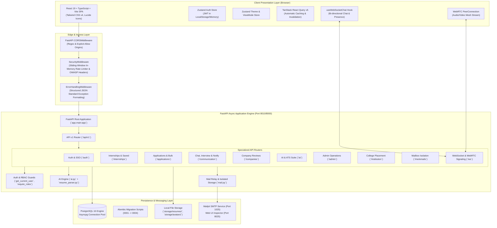
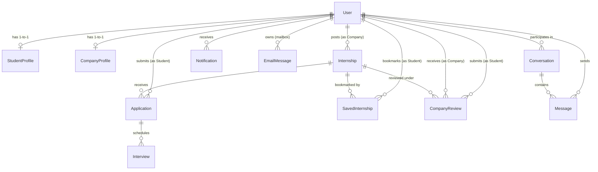
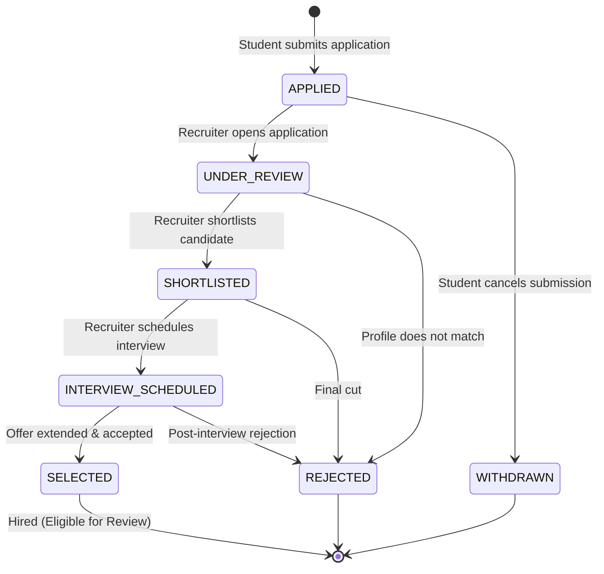

# Internship Connection Platform — Comprehensive System Architecture & Codebase Technical Manual

> **Document Version:** 2.0.0  
> **Platform Classification:** Enterprise Multi-Role Talent & Internship Ecosystem (LinkedIn / Handshake Style)  
> **Target Audience:** Engineering Leads, Full-Stack Developers, DevOps Engineers, System Architects, New Joiners  

---

## Table of Contents

1. [Executive System Overview](#1-executive-system-overview)
2. [High-Level System Architecture & Topology](#2-high-level-system-architecture--topology)
3. [Technology Stack & Dependency Matrix](#3-technology-stack--dependency-matrix)
4. [Complete Codebase Directory Tree](#4-complete-codebase-directory-tree)
5. [Comprehensive Folder & File-by-File Guide](#5-comprehensive-folder--file-by-file-guide)
   - 5.1 [Root & Orchestration Configuration](#51-root--orchestration-configuration)
   - 5.2 [CI/CD Automation (`.github/`)](#52-cicd-automation-github)
   - 5.3 [Backend: Application Entry & Core Infrastructure (`backend/app/core/`, `middleware/`)](#53-backend-application-entry--core-infrastructure)
   - 5.4 [Backend: Data Models & Persistence Layer (`backend/app/models/`)](#54-backend-data-models--persistence-layer)
   - 5.5 [Backend: Database Migrations (`backend/alembic/`)](#55-backend-database-migrations)
   - 5.6 [Backend: API Layer & Route Handlers (`backend/app/api/v1/`)](#56-backend-api-layer--route-handlers)
   - 5.7 [Backend: Pydantic Validation Schemas (`backend/app/schemas/`)](#57-backend-pydantic-validation-schemas)
   - 5.8 [Backend: Services & External Integrations (`backend/app/services/`)](#58-backend-services--external-integrations)
   - 5.9 [Backend: Comprehensive Test Suite (`backend/tests/`)](#59-backend-comprehensive-test-suite)
   - 5.10 [Frontend: Build, Config & Root Environment (`frontend/`)](#510-frontend-build-config--root-environment)
   - 5.11 [Frontend: State Management & Stores (`frontend/src/store/`)](#511-frontend-state-management--stores)
   - 5.12 [Frontend: API Client & Networking Layer (`frontend/src/api/`, `lib/`)](#512-frontend-api-client--networking-layer)
   - 5.13 [Frontend: Reusable UI Primitives (`frontend/src/components/ui/`)](#513-frontend-reusable-ui-primitives)
   - 5.14 [Frontend: Feature Components & Interactive Modals (`frontend/src/components/`)](#514-frontend-feature-components--interactive-modals)
   - 5.15 [Frontend: Application Pages & Role Views (`frontend/src/pages/`)](#515-frontend-application-pages--role-views)
   - 5.16 [Frontend: Unit & Integration Tests (`frontend/src/pages/__tests__/`)](#516-frontend-unit--integration-tests)
6. [Database Schema Deep Dive (Tables, Enums & Relationships)](#6-database-schema-deep-dive)
7. [API Endpoints Reference Matrix (All 15 Routers)](#7-api-endpoints-reference-matrix)
8. [Core Business Workflows & Execution Pipelines](#8-core-business-workflows--execution-pipelines)
   - 8.1 Multi-Tenant Authentication & Mailbox Isolation
   - 8.2 Internship Publishing & Moderation Lifecycle
   - 8.3 Student Application 7-Stage State Machine & Bulk Status Pipeline
   - 8.4 Real-Time WebSockets Messaging & User Presence
   - 8.5 WebRTC Peer-to-Peer Video Interview Signaling
   - 8.6 AI ATS Resume Matcher, Pitch Generator & Mock Interview Arena
   - 8.7 Verified Company Reviews & Rating Engine
   - 8.8 Saved Internships Bookmark System
   - 8.9 College Placement Office (TPO) Analytics & Reporting
9. [Security, RBAC & Protection Mechanisms](#9-security-rbac--protection-mechanisms)
10. [Local Development, Docker & Deployment Guide](#10-local-development-docker--deployment-guide)

---

## 1. Executive System Overview

The **Internship Connection Platform** is an enterprise-grade, asynchronous, real-time web application tailored for higher education and early-career recruitment. Designed with modern professional networking paradigms, it facilitates seamless interactions across four distinct system actors:

1. **Students**:
   - Search, filter, and discover verified internship listings with instant AI match scoring.
   - Submit rich applications with customized cover pitches, uploaded PDF resumes, and automated profile skill synchronization.
   - Track application progression through a rigorous 7-stage state machine (`APPLIED` $\rightarrow$ `UNDER_REVIEW` $\rightarrow$ `SHORTLISTED` $\rightarrow$ `INTERVIEW_SCHEDULED` $\rightarrow$ `SELECTED` or `REJECTED`/`WITHDRAWN`).
   - Engage in direct real-time chats, participate in WebRTC video interviews, review accepted companies, bookmark opportunities, and prepare via an AI Mock Interview simulator.

2. **Companies / Employers**:
   - Establish corporate profiles, submit legitimacy verification documents for admin vetting, and showcase hiring brands.
   - Author detailed internship openings with custom requirements, stipend tiers, work modes (Remote, Hybrid, On-site), and location parameters.
   - Manage applicant funnels with visual candidate pipelines, filter by ATS compatibility, execute bulk status changes, issue formal offer letters, and schedule interviews with calendar and video room links.

3. **Colleges / Training & Placement Officers (TPO)**:
   - Access the dedicated institutional portal (`/institution/portal`) to monitor real-time placement statistics, department-wise employment ratios, average stipend levels, active recruiters, and top recruiting partners directly sourced from live database records without mock data.

4. **Platform Administrators**:
   - Executive control center (`/admin`) monitoring system-wide growth, user account management, instant account suspension/reactivation, corporate profile vetting, listing content moderation, and user complaint investigation.

---

## 2. High-Level System Architecture & Topology

The platform adheres to a modern decoupled client-server architecture with an asynchronous, event-ready backend and a high-performance single-page application frontend.



---

## 3. Technology Stack & Dependency Matrix

| Layer / Subsystem | Technology | Version | Purpose in Codebase |
| :--- | :--- | :--- | :--- |
| **Backend Runtime** | Python | 3.12+ | Asynchronous core application runtime |
| **Web Framework** | FastAPI | ^0.115.0 | High-performance ASGI web framework, OpenAPI automatic documentation, dependency injection |
| **ASGI Server** | Uvicorn (standard) | ^0.34.0 | Production-ready ASGI web server with uvloop event loop |
| **ORM / Database Access** | SQLAlchemy (Async) | ^2.0.38 | Modern async Declarative ORM with asyncpg driver |
| **Database Driver** | asyncpg | ^0.30.0 | High-speed asynchronous PostgreSQL client library |
| **Database Migrations** | Alembic | ^1.14.1 | Schema revision management and forward/backward database migrations |
| **Relational Database** | PostgreSQL | 16-alpine | ACID-compliant relational data store |
| **Authentication & Tokens** | python-jose | ^3.3.0 | JSON Web Token (JWT) cryptographic signing and verification (HS256) |
| **Password Hashing** | passlib (bcrypt) | ^1.7.4 | Cryptographic hashing of passwords using bcrypt and salt rounds |
| **Data Validation** | Pydantic v2 | ^2.10.6 | Request and response schema parsing, type coercion, and runtime validation |
| **PDF Extraction Engine** | PyMuPDF (fitz) | ^1.25.3 | High-fidelity raw text extraction from uploaded student PDF resumes |
| **HTTP Client** | httpx | ^0.28.1 | Asynchronous HTTP client for Google OAuth2 token verification and external APIs |
| **Email Relay & Dev Mail** | aiosmtplib / Mailpit | ^4.0.1 / 1.21+ | Non-blocking asynchronous SMTP client relaying to Mailpit container |
| **Testing Framework** | Pytest + pytest-asyncio | ^8.3.4 | Automated asynchronous unit and integration test runner with in-memory SQLite |
| **Frontend Runtime** | Node.js | 20+ | Frontend package ecosystem and compilation environment |
| **Frontend Framework** | React 19 | ^19.2.8 | Latest modern UI library using functional components and hooks |
| **Type Safety** | TypeScript | ~6.0.2 | Complete strict-mode compile-time type validation across UI |
| **Build Tool & Dev Server** | Vite | ^8.2.2 | Ultra-fast Hot Module Replacement (HMR) bundler |
| **Styling & Design System** | Tailwind CSS v4 | ^4.3.3 | Modern CSS design tokens, custom dark-mode variants, and responsive layout classes |
| **Client State Management** | Zustand | ^5.0.15 | Lightweight reactive store for authentication, theme switching, and mobile view simulator |
| **Server State & Caching** | TanStack React Query | ^5.102.8 | Asynchronous query caching, optimistic UI updates, and stale-time invalidation |
| **Client Routing** | React Router DOM | ^7.18.3 | Declarative client-side routing, nested routes, and route guard redirects |
| **Form Management** | React Hook Form + Zod | ^7.54 / ^3.24 | Performant uncontrolled forms with type-safe schema validation |
| **Icons & Visuals** | Lucide React | ^0.475.0 | Comprehensive, lightweight SVG iconography across all dashboards |
| **Frontend Testing** | Vitest + Testing Library | ^3.2.4 / ^16.3 | Fast unit testing with JSDOM environment |
| **Containerization** | Docker & Docker Compose | Compose v2 | Multi-container orchestration (FastAPI, React Vite, PostgreSQL, Mailpit) |

---

## 4. Complete Codebase Directory Tree

```text
Internship Connection Platform/
├── .env.dev.example                         # Environment template for local development
├── .env.example                             # Base environment template
├── .env.prod.example                        # Production environment template with hardened security
├── .gitignore                               # Global Git ignore specifications
├── BACKEND_AND_SYSTEM_ARCHITECTURE.md       # Original backend-specific architecture notes
├── docker-compose.prod.yml                  # Production multi-stage Docker deployment definition
├── docker-compose.yml                       # Primary local multi-container development orchestration
├── README.md                                # Repository introduction and onboarding guide
│
├── .github/
│   └── workflows/
│       └── ci.yml                           # GitHub Actions Continuous Integration pipeline
│
├── backend/
│   ├── .dockerignore                        # Docker build context exclusions for backend
│   ├── .env                                 # Local backend environment variables (git-ignored)
│   ├── alembic.ini                          # Alembic CLI configuration and database URL lookup
│   ├── Dockerfile                           # Production Python 3.12 ASGI Docker container build
│   ├── full_live_verification.py            # Comprehensive live integration probe script
│   ├── full_verification_evidence.json      # Output log artifacts from automated live stack run
│   ├── requirements.txt                     # Pinned Python package dependencies
│   ├── run_mailpit.py                       # Standalone local Python mailpit server runner
│   │
│   ├── alembic/
│   │   ├── env.py                           # Alembic environment runner loading SQLModel metadata
│   │   ├── script.py.mako                   # Template for auto-generating migration scripts
│   │   └── versions/
│   │       ├── 0001_auth_tables.py          # Initial migration: users, profiles, jobs, applications
│   │       ├── 0002_email_verification_states.py # Adds verification tokens and verification states
│   │       ├── 0003_email_messages.py       # Isolated transactional email message log table
│   │       └── 0004_saved_internships_and_company_reviews.py # Bookmarks & verified reviews
│   │
│   ├── app/
│   │   ├── main.py                          # Application factory, middleware setup & lifecycle
│   │   ├── seed.py                          # Production database seeder for admin accounts
│   │   │
│   │   ├── api/
│   │   │   └── v1/
│   │   │       ├── admin.py                 # Admin dashboard, moderation & user suspension APIs
│   │   │       ├── ai.py                    # AI ATS score calculation & pitch generation endpoints
│   │   │       ├── analytics.py             # Role-based recruitment funnel & domain analytics
│   │   │       ├── applications.py          # Application submission, 7-stage state machine & bulk update
│   │   │       ├── auth.py                  # Register, OTP verify, login, refresh & Google SSO
│   │   │       ├── communication.py         # Contacts, 1-on-1 chat, interviews & notifications
│   │   │       ├── dependencies.py          # FastApi Depends: DbSession, JWT auth & RBAC guards
│   │   │       ├── institution.py           # College Placement Officer (TPO) statistics APIs
│   │   │       ├── internships.py           # Job posting, browse, search, filters & save/unsave
│   │   │       ├── mailbox.py               # Authenticated per-user isolated email inbox APIs
│   │   │       ├── profiles.py              # Student/Company profile fetch, update & avatar uploads
│   │   │       ├── reports.py               # User and listing misconduct reporting APIs
│   │   │       ├── reviews.py               # Student-verified company reviews & rating calculations
│   │   │       ├── router.py                # Central APIRouter aggregating all v1 sub-routers
│   │   │       └── ws.py                    # WebSockets connection manager & WebRTC signaling
│   │   │
│   │   ├── core/
│   │   │   ├── config.py                    # Pydantic Settings reading environment variables
│   │   │   ├── database.py                  # Async SQLAlchemy engine & async_session_factory
│   │   │   ├── logging.py                   # Custom structured console and file logging setup
│   │   │   └── security.py                  # Passlib bcrypt hashing & Jose JWT creation/validation
│   │   │
│   │   ├── middleware/
│   │   │   ├── errors.py                    # Global unexpected exception interceptor
│   │   │   └── security.py                  # Rate-limiting sliding window & OWASP security headers
│   │   │
│   │   ├── models/
│   │   │   ├── __init__.py                  # Model package export registry
│   │   │   ├── base.py                      # SQLAlchemy declarative Base with naming conventions
│   │   │   └── user.py                      # All SQLAlchemy entity declarations (13 tables)
│   │   │
│   │   ├── schemas/
│   │   │   ├── admin.py                     # Pydantic models for admin stats & user moderation
│   │   │   ├── application.py               # Models for application create, status change & bulk ops
│   │   │   ├── auth.py                      # Models for registration, login tokens & passwords
│   │   │   ├── communication.py             # Models for chat messages, interviews & notifications
│   │   │   ├── internship.py                # Models for internship posting, filtering & pagination
│   │   │   └── profile.py                   # Models for student, company & educational profiles
│   │   │
│   │   └── services/
│   │       ├── ai.py                        # Heuristic ATS scoring, keyword match & pitch generation
│   │       ├── email_validation.py          # Disposable email blocklist & domain format validator
│   │       ├── mail.py                      # Asynchronous SMTP mail delivery & email log recorder
│   │       ├── mailpit_server.py            # Local in-memory SMTP/HTTP fallback server
│   │       ├── pdf.py                       # PyMuPDF binary PDF text extraction utility
│   │       └── resume_parser.py             # Advanced regex taxonomy parser for skills & degrees
│   │
│   ├── storage/
│   │   ├── avatars/                         # Local filesystem storage for uploaded user avatars
│   │   └── resumes/                         # Local filesystem storage for uploaded student resumes
│   │
│   └── tests/                               # 23 automated backend test suites
│       ├── conftest.py                      # Test fixtures, in-memory SQLite async DB & mock clients
│       ├── test_admin.py                    # Verifies admin dashboard stats and listing moderation
│       ├── test_admin_signup.py             # Verifies strict role controls on admin registration
│       ├── test_ai.py                       # Verifies ATS scoring algorithms and pitch generators
│       ├── test_analytics_and_avatars.py    # Tests pipeline analytics queries and avatar uploads
│       ├── test_applications.py             # Tests student application creation and status pipeline
│       ├── test_auth_guard.py               # Tests invalid tokens, expired JWTs and access controls
│       ├── test_bulk_applications.py        # Tests company bulk application status transitions
│       ├── test_communication.py            # Tests 1-on-1 chat threads, messaging and interviews
│       ├── test_company_reviews.py          # Tests verified student company review constraints
│       ├── test_email_isolation.py          # Tests cross-tenant email isolation in mailbox
│       ├── test_email_validation.py         # Tests disposable email detection logic
│       ├── test_google_auth.py              # Tests mocked Google OAuth2 SSO verification flow
│       ├── test_health.py                   # Tests API health-check endpoint and ping status
│       ├── test_institution.py              # Tests institutional TPO placement metrics queries
│       ├── test_integration.py              # Full end-to-end user journey integration tests
│       ├── test_internships.py              # Tests internship creation, update and browsing
│       ├── test_live_stack.py               # Tests live server integration against running DB
│       ├── test_otp_auth.py                 # Tests OTP generation, delivery and verification
│       ├── test_resume_parser.py            # Tests skill extraction and university degree parsing
│       ├── test_resume_policy.py            # Tests PDF file size and MIME type upload guards
│       ├── test_route_coverage.py           # Automated audit ensuring all routes have auth tests
│       ├── test_saved_internships.py        # Tests bookmarking, unbookmarking and saved list
│       └── test_security.py                 # Tests rate limiting, OWASP headers and CORS policies
│
└── frontend/
    ├── .dockerignore                        # Docker build context exclusions for frontend
    ├── .env.example                         # Example environment file for Vite dev server
    ├── .oxlintrc.json                       # Fast Oxlint linter configuration
    ├── Dockerfile                           # Multi-stage production Nginx frontend container
    ├── index.html                           # Single Page Application HTML5 entry point
    ├── nginx.conf                           # Production Nginx reverse-proxy & routing config
    ├── package.json                         # Node dependencies, build scripts and tooling
    ├── tsconfig.app.json                    # TypeScript compiler settings for frontend application
    ├── tsconfig.json                        # Root TypeScript configuration
    ├── tsconfig.node.json                   # TypeScript compiler settings for Vite config
    ├── vite.config.ts                       # Vite build configuration, aliases & dev proxy
    ├── vitest.config.ts                     # Vitest test runner configuration
    │
    └── src/
        ├── App.css                          # Minimal global CSS overrides
        ├── App.test.tsx                     # Top-level application render tests
        ├── App.tsx                          # Core application router, auth provider & route layout
        ├── index.css                        # Tailwind CSS v4 design tokens and custom utility classes
        ├── main.tsx                         # React 19 DOM root mounting entrypoint
        │
        ├── api/
        │   └── client.ts                    # Axios HTTP instance with JWT interceptors & token refresh
        │
        ├── components/
        │   ├── ProtectedRoute.tsx           # Route authorization guard inspecting user role
        │   │
        │   ├── analytics/
        │   │   └── DesktopAnalysisVisuals.tsx # Charts, recruitment velocity & KPI dashboard cards
        │   │
        │   ├── auth/
        │   │   ├── AccountSecurityCard.tsx  # Password reset and session management card
        │   │   └── GoogleSignInButton.tsx   # Google Identity Services OAuth button integration
        │   │
        │   ├── dashboard/
        │   │   └── WelcomeGreeting.tsx      # Dynamic personalized banner with contextual role stats
        │   │
        │   ├── layout/
        │   │   ├── Logo.tsx                 # Brand SVG logo with responsive text variations
        │   │   └── Navbar.tsx               # Main navigation bar with notification badges & theme toggle
        │   │
        │   ├── modals/
        │   │   ├── ApplyModal.tsx           # Application submission modal with live ATS gauge & pitch
        │   │   ├── MockInterviewModal.tsx   # Interactive AI mock interview simulator modal
        │   │   ├── OfferLetterModal.tsx     # In-app formal offer letter viewer with digital signature
        │   │   ├── RecommendationModal.tsx  # University faculty endorsement request modal
        │   │   ├── ReportModal.tsx          # Flagging modal for reporting scam/inappropriate content
        │   │   ├── ReviewCompanyModal.tsx   # 5-star rating & feedback modal for verified interns
        │   │   ├── ScheduleInterviewModal.tsx # Interview scheduler with video, phone & in-person options
        │   │   ├── SkillQuizModal.tsx       # Timed multiple-choice technical skill assessment modal
        │   │   └── VideoInterviewModal.tsx  # WebRTC peer-to-peer live video interview room modal
        │   │
        │   ├── resume/
        │   │   └── ResumeEditorModal.tsx    # Interactive WYSIWYG resume builder and PDF previewer
        │   │
        │   └── ui/
        │       ├── AvatarUploadCard.tsx     # Drag-and-drop user profile avatar uploader
        │       ├── Badge.tsx                # Status and pill badge component
        │       ├── Button.tsx               # Accessible polymorphic button with loading spinners
        │       ├── Card.tsx                 # Standard rounded card with borders and dark mode styles
        │       ├── EmptyState.tsx           # Visual placeholder for empty lists and data queries
        │       ├── ErrorBoundary.tsx        # React class error boundary preventing white-screen crashes
        │       ├── ErrorState.tsx           # Formatted alert card displaying retryable API errors
        │       ├── Input.tsx                # Text input primitive with label, hint, and error states
        │       ├── LoadingSkeleton.tsx      # Shimmer placeholder skeleton for async data loading
        │       ├── MobileViewSimulator.tsx  # Floating drawer previewing student view on mobile screens
        │       ├── Modal.tsx                # Accessible backdrop dialog modal with escape-key handling
        │       ├── Select.tsx               # Form dropdown component with custom chevron styling
        │       └── Textarea.tsx             # Multi-line text input with automatic character counters
        │
        ├── lib/
        │   ├── notifications.ts             # Browser native desktop notification helper
        │   ├── useWebSocketChat.ts          # Custom React hook for live WebSocket chat & presence
        │   └── utils.ts                     # Tailwind class merging utility (`clsx` + `twMerge`)
        │
        ├── pages/
        │   ├── AdminPages.tsx               # Admin portal: User management, verification & moderation
        │   ├── ApplicationPages.tsx         # Legacy application router and redirect helper
        │   ├── AuthPages.tsx                # Login, registration, OTP verification & password reset
        │   ├── CollegePlacementPortal.tsx   # University TPO dashboard with departmental analytics
        │   ├── CommunicationPages.tsx       # Full-featured messaging, interview room & notifications
        │   ├── CompanyPages.tsx             # Employer dashboard, job authoring & ATS candidate pipeline
        │   ├── InternshipPages.tsx          # Internship search, advanced filters & detailed view
        │   ├── LandingPage.tsx              # High-converting marketing homepage with hero & features
        │   ├── ProfilePages.tsx             # Student and company profile viewing and editing pages
        │   ├── StudentPages.tsx             # Student hub: applied jobs, saved bookmarks & skill quizzes
        │   │
        │   └── __tests__/
        │       ├── dashboard_features.test.tsx # Component tests for dashboard greeting and quick links
        │       └── messages_render.test.tsx    # Component tests for messaging thread list rendering
        │
        └── store/
            ├── auth.ts                      # Zustand store managing user authentication & tokens
            ├── theme.ts                     # Zustand store controlling dark, light, and system modes
            └── viewMode.ts                  # Zustand store toggling between desktop and simulated mobile
```

---

## 5. Comprehensive Folder & File-by-File Guide

### 5.1 Root & Orchestration Configuration

- [`docker-compose.yml`](file:///d:/shortfundly%20app/Internship%20Connection%20Platform/docker-compose.yml)  
  Defines the complete local multi-container development environment. Orchestrates four interconnected containers:
  1. `backend`: Runs FastAPI on port `8010` (mapped from `8000`), mounts local code for hot reloading, and links to PostgreSQL and Mailpit.
  2. `frontend`: Runs Vite dev server on port `5174` (mapped from `5173`), auto-reloads on React code modifications.
  3. `db`: Runs PostgreSQL 16 Alpine on port `5432` with a persistent named Docker volume (`postgres_data`).
  4. `mailpit`: Runs Mailpit SMTP on port `1025` and web UI on port `8025` for viewing sent transactional emails.

- [`docker-compose.prod.yml`](file:///d:/shortfundly%20app/Internship%20Connection%20Platform/docker-compose.prod.yml)  
  Production-grade container configuration featuring multi-stage production builds, Nginx static file serving for the React frontend, non-root user execution, and hardened environment variables.

- [`.env.example`](file:///d:/shortfundly%20app/Internship%20Connection%20Platform/.env.example) & [`.env.dev.example`](file:///d:/shortfundly%20app/Internship%20Connection%20Platform/.env.dev.example)  
  Template configuration files specifying default development environment variables including database credentials, JWT secret keys, token expiration times, CORS allowed origins, and SMTP server endpoints.

- [`.env.prod.example`](file:///d:/shortfundly%20app/Internship%20Connection%20Platform/.env.prod.example)  
  Production template providing guidance for secure secrets, domain name routing, Google OAuth client credentials, and production mail relays.

- [`.gitignore`](file:///d:/shortfundly%20app/Internship%20Connection%20Platform/.gitignore)  
  Specifies directory and file patterns that Git must not track, such as `.env`, `node_modules/`, Python `.venv/`, `dist/`, uploaded user media (`storage/`), and test caches (`.pytest_cache/`).

- [`README.md`](file:///d:/shortfundly%20app/Internship%20Connection%20Platform/README.md)  
  High-level onboarding documentation for new developers, outlining setup commands, default ports, and feature highlights.

---

### 5.2 CI/CD Automation (`.github/`)

- [`.github/workflows/ci.yml`](file:///d:/shortfundly%20app/Internship%20Connection%20Platform/.github/workflows/ci.yml)  
  The GitHub Actions Continuous Integration pipeline. Automatically triggers on every push and pull request to `main` and `dev` branches:
  - **Backend Job**: Sets up Python 3.12, installs dependencies, spins up a PostgreSQL service container, runs Alembic migrations, and executes all 23 Pytest suites.
  - **Frontend Job**: Sets up Node.js 20, installs dependencies, executes Vitest component tests, runs Oxlint, and validates production TypeScript compilation (`npm run build`).

---

### 5.3 Backend: Application Entry & Core Infrastructure

- [`backend/app/main.py`](file:///d:/shortfundly%20app/Internship%20Connection%20Platform/backend/app/main.py)  
  The ASGI entrypoint and root FastAPI application factory.
  - Configures CORS middleware supporting credentials and dynamic origin matching.
  - Attaches custom `SecurityMiddleware` for rate-limiting and security headers.
  - Attaches `ErrorHandlingMiddleware` to normalize unhandled exceptions into structured JSON responses.
  - Mounts static directories for avatars and resumes (`/api/v1/storage`).
  - Registers the primary API v1 router under the `/api/v1` prefix.
  - Declares the `/api/health` probe endpoint returning system status and uptime.

- [`backend/app/core/config.py`](file:///d:/shortfundly%20app/Internship%20Connection%20Platform/backend/app/core/config.py)  
  Centralized settings management powered by Pydantic's `BaseSettings`. Strongly validates environment variables for PostgreSQL connection URLs, JWT secrets, token validity duration, SMTP configuration, and Google OAuth credentials.

- [`backend/app/core/database.py`](file:///d:/shortfundly%20app/Internship%20Connection%20Platform/backend/app/core/database.py)  
  Database connection engine. Creates the asynchronous SQLAlchemy engine (`create_async_engine`) with connection pooling, and defines `async_session_factory` used by the dependency injection system to provide transactional sessions to route handlers.

- [`backend/app/core/security.py`](file:///d:/shortfundly%20app/Internship%20Connection%20Platform/backend/app/core/security.py)  
  Cryptographic utility library.
  - Provides `hash_password(pwd: str)` and `verify_password(plain: str, hashed: str)` utilizing `passlib` with bcrypt.
  - Provides `create_access_token(data: dict)` and `create_refresh_token(data: dict)` generating HMAC-SHA256 signed JWTs with expiration timestamps.

- [`backend/app/core/logging.py`](file:///d:/shortfundly%20app/Internship%20Connection%20Platform/backend/app/core/logging.py)  
  Structured logging configuration. Sets standardized log formatting, log levels, and console handlers across the entire application.

- [`backend/app/middleware/security.py`](file:///d:/shortfundly%20app/Internship%20Connection%20Platform/backend/app/middleware/security.py)  
  Defines `SecurityMiddleware`.
  - **Sliding-Window Rate Limiter**: Tracks incoming request timestamps per client IP in an in-memory sliding window, automatically rejecting abusive clients exceeding thresholds with HTTP 429 Too Many Requests.
  - **OWASP Headers**: Appends critical browser security headers to every response (`X-Content-Type-Options: nosniff`, `X-Frame-Options: DENY`, `X-XSS-Protection: 1; mode=block`, `Strict-Transport-Security`, and Content Security Policy).

- [`backend/app/middleware/errors.py`](file:///d:/shortfundly%20app/Internship%20Connection%20Platform/backend/app/middleware/errors.py)  
  Defines `ErrorHandlingMiddleware`. Catches any unhandled Python exception bubbling up from route execution, logs the stack trace securely, and returns a unified JSON error object (`{"detail": "Internal Server Error", "status_code": 500}`).

- [`backend/app/seed.py`](file:///d:/shortfundly%20app/Internship%20Connection%20Platform/backend/app/seed.py)  
  Idempotent administrative seeder. Ensures default verified administrator accounts are initialized in the database with secure hashed passwords without creating fake mock students or internships.

---

### 5.4 Backend: Data Models & Persistence Layer

- [`backend/app/models/base.py`](file:///d:/shortfundly%20app/Internship%20Connection%20Platform/backend/app/models/base.py)  
  Declarative SQLAlchemy base class (`Base`) configured with standard metadata and naming conventions for primary keys, foreign keys, and indexes.

- [`backend/app/models/user.py`](file:///d:/shortfundly%20app/Internship%20Connection%20Platform/backend/app/models/user.py)  
  The core relational database model definitions comprising 13 tables:
  1. `User`: Identity core containing email, password hash, role (`STUDENT`, `COMPANY`, `ADMIN`), active state, verification state, and OTP fields.
  2. `StudentProfile`: 1-to-1 extension of student users containing university, major, graduation year, GPA, bio, skills string, phone, resume path, and avatar path.
  3. `CompanyProfile`: 1-to-1 extension of company users containing company name, website, industry, company size, bio, location, verification status, and logo path.
  4. `Internship`: Internship posting authored by a company user with title, description, requirements, skills, location, type (`REMOTE`, `HYBRID`, `ONSITE`), stipend, and status (`DRAFT`, `PUBLISHED`, `CLOSED`).
  5. `Application`: Student submission linking a student to an internship, tracking status (`APPLIED`, `UNDER_REVIEW`, `SHORTLISTED`, `INTERVIEW_SCHEDULED`, `SELECTED`, `REJECTED`, `WITHDRAWN`), cover note, and resume path.
  6. `Interview`: Scheduled meeting between applicant and company with start time, end time, interview type (`VIDEO`, `PHONE`, `IN_PERSON`), meeting link, and notes.
  7. `Conversation`: 1-to-1 direct messaging thread between a student and a company.
  8. `Message`: Individual chat message in a conversation with sender reference, content, and read timestamp.
  9. `Notification`: User notifications feed tracking title, message, type, and read boolean.
  10. `Report`: Misconduct report against a user or internship listing under review by administrators.
  11. `EmailMessage`: Isolated per-user transactional email log recording recipient, sender, subject, and body for the user mailbox.
  12. `SavedInternship`: Bookmark record linking a student to an internship opportunity.
  13. `CompanyReview`: Verified 5-star rating and written review submitted by students selected for company internships.

- [`backend/app/models/__init__.py`](file:///d:/shortfundly%20app/Internship%20Connection%20Platform/backend/app/models/__init__.py)  
  Cleanly exposes all models and enum classes (`User`, `UserRole`, `Internship`, `Application`, etc.) for convenient imports throughout the app and in Alembic.

---

### 5.5 Backend: Database Migrations

- [`backend/alembic/env.py`](file:///d:/shortfundly%20app/Internship%20Connection%20Platform/backend/alembic/env.py)  
  Alembic migration runner configured to inspect `Base.metadata` from `app.models` and handle async connections.

- [`backend/alembic/versions/0001_auth_tables.py`](file:///d:/shortfundly%20app/Internship%20Connection%20Platform/backend/alembic/versions/0001_auth_tables.py)  
  Initial foundational migration creating `users`, `student_profiles`, `company_profiles`, `internships`, `applications`, `interviews`, `conversations`, `messages`, `notifications`, and `reports`.

- [`backend/alembic/versions/0002_email_verification_states.py`](file:///d:/shortfundly%20app/Internship%20Connection%20Platform/backend/alembic/versions/0002_email_verification_states.py)  
  Adds columns for email verification codes, expiration timestamps, and verified flags.

- [`backend/alembic/versions/0003_email_messages.py`](file:///d:/shortfundly%20app/Internship%20Connection%20Platform/backend/alembic/versions/0003_email_messages.py)  
  Creates the `email_messages` table to persist outbound system emails per user for secure in-app viewing.

- [`backend/alembic/versions/0004_saved_internships_and_company_reviews.py`](file:///d:/shortfundly%20app/Internship%20Connection%20Platform/backend/alembic/versions/0004_saved_internships_and_company_reviews.py)  
  Creates `saved_internships` (student bookmarks) and `company_reviews` (ratings from hired students) tables with foreign keys and unique constraints.

---

### 5.6 Backend: API Layer & Route Handlers

- [`backend/app/api/v1/router.py`](file:///d:/shortfundly%20app/Internship%20Connection%20Platform/backend/app/api/v1/router.py)  
  The aggregator router that mounts all sub-routers with their respective path prefixes and OpenAPI tags:
  - `/auth` $\rightarrow$ `auth.router`
  - `/profiles` $\rightarrow$ `profiles.router`
  - `/internships` $\rightarrow$ `internships.router`
  - `/applications` $\rightarrow$ `applications.router`
  - `/admin` $\rightarrow$ `admin.router`
  - `/communication` $\rightarrow$ `communication.router`
  - `/ai` $\rightarrow$ `ai.router`
  - `/reports` $\rightarrow$ `reports.router`
  - `/institution` $\rightarrow$ `institution.router`
  - `/analytics` $\rightarrow$ `analytics.router`
  - `/companies` $\rightarrow$ `reviews.router`
  - `/ws` $\rightarrow$ `ws.router`
  - `/` $\rightarrow$ `mailbox.router`

- [`backend/app/api/v1/dependencies.py`](file:///d:/shortfundly%20app/Internship%20Connection%20Platform/backend/app/api/v1/dependencies.py)  
  Dependency injection definitions:
  - `get_db()`: Asynchronous generator yielding an isolated database session per request.
  - `get_current_user()`: Validates the JWT Bearer token from the `Authorization` header, decodes user ID, and retrieves the active user.
  - `get_current_user_optional()`: Retrieves the user if a valid token is present; returns `None` otherwise.
  - `require_roles(*roles)`: Higher-order dependency enforcing Role-Based Access Control (RBAC), raising HTTP 403 Forbidden if user role is unauthorized.

- [`backend/app/api/v1/auth.py`](file:///d:/shortfundly%20app/Internship%20Connection%20Platform/backend/app/api/v1/auth.py)  
  Handles authentication workflows:
  - `POST /register`: Registers student or company with disposable email checks and dispatches OTP email.
  - `POST /verify-otp`: Confirms OTP code and activates the account.
  - `POST /resend-otp`: Generates a fresh OTP and resends it.
  - `POST /login`: Validates credentials and issues JWT access and refresh token pairs.
  - `POST /refresh`: Validates refresh token and issues a fresh access token without re-login.
  - `POST /google`: Validates Google OAuth2 ID tokens via Google API and creates/authenticates user.
  - `POST /forgot-password` & `POST /reset-password`: Delivers password reset token via email and updates password.

- [`backend/app/api/v1/internships.py`](file:///d:/shortfundly%20app/Internship%20Connection%20Platform/backend/app/api/v1/internships.py)  
  Manages internship listings:
  - `GET /`: Lists published internships with full-text search, location filter, remote toggle, industry, and stipend sort. Includes personalized ATS match scores for logged-in students.
  - `GET /saved`: Lists all internships bookmarked by the authenticated student.
  - `POST /{id}/save`: Bookmarks an internship for later application.
  - `DELETE /{id}/save`: Removes bookmark from an internship.
  - `POST /`: Authors a new internship posting (companies only).
  - `GET /{id}`: Returns detailed job specification and company profile.
  - `PUT /{id}`: Edits an existing internship posting (owner only).
  - `DELETE /{id}`: Soft-deletes or deletes an internship posting (owner only).
  - `POST /{id}/close`: Closes an active listing to new applicants.

- [`backend/app/api/v1/applications.py`](file:///d:/shortfundly%20app/Internship%20Connection%20Platform/backend/app/api/v1/applications.py)  
  Manages the recruitment pipeline:
  - `POST /internships/{id}`: Submits application with cover letter and chosen resume.
  - `GET /mine`: Student dashboard fetching application status counts and submission history.
  - `GET /internships/{id}`: Company view fetching all candidate applications for a specific listing.
  - `POST /bulk-status`: Updates multiple applicant statuses simultaneously (e.g. bulk shortlist or reject) with validation and background notifications.
  - `PATCH /{id}/status`: Advances an individual application through the 7-stage state machine (`UNDER_REVIEW`, `SHORTLISTED`, `SELECTED`, `REJECTED`, `WITHDRAWN`).
  - Semantic shortcut endpoints: `PATCH /{id}/review`, `shortlist`, `select`, `reject`, `withdraw`.

- [`backend/app/api/v1/reviews.py`](file:///d:/shortfundly%20app/Internship%20Connection%20Platform/backend/app/api/v1/reviews.py)  
  Student-verified company reviews system:
  - `POST /{company_id}/reviews`: Submits a 1-to-5 star rating and detailed written review. Enforces strict verification: the student **must** have an application with status `SELECTED` for an internship at that company.
  - `GET /{company_id}/reviews`: Retrieves company reviews summary with aggregate star rating, total review count, and reviewer student details.

- [`backend/app/api/v1/communication.py`](file:///d:/shortfundly%20app/Internship%20Connection%20Platform/backend/app/api/v1/communication.py)  
  Unified communication hub:
  - `GET /contacts` & `GET /contacts/recommended`: Lists relevant peer contacts and candidate connections.
  - `GET /conversations` & `POST /conversations`: Manages 1-on-1 direct messaging threads.
  - `GET /conversations/{id}/messages` & `POST /conversations/{id}/messages`: Fetches chat history and sends new direct messages.
  - `POST /applications/{id}/interviews`: Schedules video, phone, or in-person interview.
  - `GET /interviews/my`: Lists scheduled interviews for the current user.
  - `PATCH /interviews/{id}`: Modifies interview time, status, or meeting link.
  - `GET /notifications`: Fetches user notifications feed.
  - `PATCH /notifications/read-all` & `PATCH /notifications/{id}/read`: Marks notifications as read.

- [`backend/app/api/v1/ws.py`](file:///d:/shortfundly%20app/Internship%20Connection%20Platform/backend/app/api/v1/ws.py)  
  High-concurrency real-time WebSocket connection manager:
  - `WS /ws/chat/{user_id}`: Maintains bi-directional chat socket connection, broadcasts real-time presence (online/offline) and dispatches instant incoming messages without polling.
  - `WS /ws/video-signal/{interview_id}`: Relays WebRTC signaling data (SDP offer/answer and ICE candidates) between interviewer and candidate for direct peer-to-peer browser video calls.

- [`backend/app/api/v1/ai.py`](file:///d:/shortfundly%20app/Internship%20Connection%20Platform/backend/app/api/v1/ai.py)  
  AI and intelligence endpoints:
  - `GET /internships/{id}/ats-score`: Parses student's uploaded PDF resume, extracts skills, compares with job specifications, and calculates a match percentage score with actionable improvement tips.
  - `POST /internships/{id}/generate-pitch`: Automatically crafts a customized, persuasive 2-paragraph cover pitch matching student qualifications with internship requirements.
  - `GET /internships/{id}/mock-interview`: Generates 5 technical and behavioral interview questions tailored to the internship role.
  - `POST /mock-interview/evaluate`: Evaluates student's recorded or typed interview answers and returns constructive feedback and scores.

- [`backend/app/api/v1/admin.py`](file:///d:/shortfundly%20app/Internship%20Connection%20Platform/backend/app/api/v1/admin.py)  
  Administrative moderation endpoints:
  - `GET /dashboard`: Aggregates real-time counts of users, students, companies, active internships, pending verifications, and unresolved reports.
  - `GET /users`: Searches and filters users by role and status.
  - `POST /users/{id}/suspend` & `POST /users/{id}/reactivate`: Instantly revokes or restores platform access.
  - `GET /verifications` & `POST /companies/{id}/verification`: Reviews corporate credentials and marks companies `VERIFIED` or `REJECTED`.
  - `GET /internships` & `POST /internships/{id}/moderate`: Moderates posted listings (`PUBLISHED`, `REJECTED`, `CLOSED`).
  - `GET /reports` & `PATCH /reports/{id}`: Investigates misconduct flags.

- [`backend/app/api/v1/institution.py`](file:///d:/shortfundly%20app/Internship%20Connection%20Platform/backend/app/api/v1/institution.py)  
  University & TPO portal analytics:
  - `GET /placement-stats`: Aggregates placement rate percentages, total students placed, department-wise placement distributions, average stipend levels, and active recruiter partner statistics directly from PostgreSQL records.

- [`backend/app/api/v1/analytics.py`](file:///d:/shortfundly%20app/Internship%20Connection%20Platform/backend/app/api/v1/analytics.py)  
  Platform recruitment funnel metrics:
  - `GET /overview`: Returns personal funnel stages (`applied`, `screened`, `interviews`, `offers`), monthly application velocity, and industry domain distributions dynamically tailored to student, company, or administrator roles.

- [`backend/app/api/v1/profiles.py`](file:///d:/shortfundly%20app/Internship%20Connection%20Platform/backend/app/api/v1/profiles.py)  
  Profile management:
  - `GET /me`: Returns the authenticated user's profile and nested student/company data.
  - `PUT /me/student` & `PUT /me/company`: Updates student academic details or company brand details.
  - `POST /me/resume`: Uploads student PDF resume with file size and MIME-type validation, triggering automatic skill parsing.
  - `POST /me/avatar`: Uploads and stores profile avatar images.
  - `GET /students/{id}` & `GET /companies/{id}`: Public profile view endpoints for verified networking.

- [`backend/app/api/v1/mailbox.py`](file:///d:/shortfundly%20app/Internship%20Connection%20Platform/backend/app/api/v1/mailbox.py)  
  Secure multi-tenant mailbox:
  - `GET /me/emails`: Retrieves outbound transactional emails belonging exclusively to the authenticated user ID, ensuring total privacy for OTP codes and status notifications.

- [`backend/app/api/v1/reports.py`](file:///d:/shortfundly%20app/Internship%20Connection%20Platform/backend/app/api/v1/reports.py)  
  Misconduct reporting:
  - `POST /`: Allows any authenticated user to submit a flag against an inappropriate user or scam job listing.

---

### 5.7 Backend: Pydantic Validation Schemas

- [`backend/app/schemas/auth.py`](file:///d:/shortfundly%20app/Internship%20Connection%20Platform/backend/app/schemas/auth.py)  
  Defines `UserRegister`, `UserLogin`, `TokenResponse`, `OTPVerify`, `PasswordResetRequest`, and `PasswordResetConfirm` schemas with strict email and password complexity validators.

- [`backend/app/schemas/internship.py`](file:///d:/shortfundly%20app/Internship%20Connection%20Platform/backend/app/schemas/internship.py)  
  Defines `InternshipInput`, `InternshipResponse`, `InternshipPage`, and query filter schemas with validation for stipend numbers, dates, and enumeration values.

- [`backend/app/schemas/application.py`](file:///d:/shortfundly%20app/Internship%20Connection%20Platform/backend/app/schemas/application.py)  
  Defines `ApplicationCreate`, `ApplicationResponse`, `ApplicationDashboard`, `ApplicationStatusUpdate`, and `BulkApplicationStatusUpdate` schemas.

- [`backend/app/schemas/profile.py`](file:///d:/shortfundly%20app/Internship%20Connection%20Platform/backend/app/schemas/profile.py)  
  Defines `StudentProfileInput`, `CompanyProfileInput`, and combined `UserProfileResponse` schemas.

- [`backend/app/schemas/communication.py`](file:///d:/shortfundly%20app/Internship%20Connection%20Platform/backend/app/schemas/communication.py)  
  Defines `MessageCreate`, `MessageResponse`, `InterviewCreate`, `InterviewResponse`, and `NotificationResponse` schemas.

- [`backend/app/schemas/admin.py`](file:///d:/shortfundly%20app/Internship%20Connection%20Platform/backend/app/schemas/admin.py)  
  Defines `AdminDashboardStats`, `UserModerationAction`, and `ReportAction` schemas.

---

### 5.8 Backend: Services & External Integrations

- [`backend/app/services/pdf.py`](file:///d:/shortfundly%20app/Internship%20Connection%20Platform/backend/app/services/pdf.py)  
  High-performance PDF text extraction engine. Utilizes `PyMuPDF` (`fitz`) to extract clean, normalized text strings from uploaded resume binaries.

- [`backend/app/services/resume_parser.py`](file:///d:/shortfundly%20app/Internship%20Connection%20Platform/backend/app/services/resume_parser.py)  
  Curated taxonomy parser. Analyzes extracted resume text against an industry taxonomy of over 100 technical and business skills (Languages, Frontend, Backend, Cloud, Databases, Machine Learning), extracting degrees (B.Tech, M.S., B.S., MBA), majors (Computer Science, Data Science), universities, email addresses, and phone numbers to auto-populate student profiles.

- [`backend/app/services/ai.py`](file:///d:/shortfundly%20app/Internship%20Connection%20Platform/backend/app/services/ai.py)  
  AI matching and generator suite:
  - `compute_ats_score()`: Evaluates resume content against internship requirements, weighing skill overlaps, job title keyword presence, and document depth to compute an accurate ATS score (35% to 98%) with specific strengths and gap recommendations.
  - `compute_match_score_fast()`: Lightweight algorithm embedded directly into job browsing queries for instantaneous candidate compatibility sorting.
  - `generate_cover_pitch()`: Synthesizes candidate skills and target company details into a high-impact cover note.
  - `generate_mock_interview_questions()`: Generates structured technical questions with rubrics.
  - `evaluate_mock_interview_answer()`: Scores student responses on clarity, technical accuracy, and completeness.

- [`backend/app/services/mail.py`](file:///d:/shortfundly%20app/Internship%20Connection%20Platform/backend/app/services/mail.py)  
  Non-blocking email delivery service. Dispatches HTML-formatted transactional emails (OTP codes, application updates, interview invitations) via `aiosmtplib` and persists a copy in the `email_messages` table for in-app mailbox viewing.

- [`backend/app/services/email_validation.py`](file:///d:/shortfundly%20app/Internship%20Connection%20Platform/backend/app/services/email_validation.py)  
  Email verification guard. Enforces valid email syntax and rejects registration attempts using known temporary or disposable email providers (e.g. Mailinator, 10MinuteMail, GuerrillaMail).

- [`backend/app/services/mailpit_server.py`](file:///d:/shortfundly%20app/Internship%20Connection%20Platform/backend/app/services/mailpit_server.py)  
  Pure Python local SMTP and HTTP inbox server fallback. Enables testing transactional email flows in local environments without running external Docker containers.

---

### 5.9 Backend: Comprehensive Test Suite (`backend/tests/`)

The backend contains 23 automated Pytest test suites executing against an asynchronous in-memory SQLite database, verifying all aspects of platform integrity:

- [`tests/conftest.py`](file:///d:/shortfundly%20app/Internship%20Connection%20Platform/backend/tests/conftest.py): Global test fixtures, async test client, and isolated test database setup.
- [`tests/test_auth_guard.py`](file:///d:/shortfundly%20app/Internship%20Connection%20Platform/backend/tests/test_auth_guard.py): Verifies JWT expiration, malformed tokens, missing authorization headers, and role access denial.
- [`tests/test_otp_auth.py`](file:///d:/shortfundly%20app/Internship%20Connection%20Platform/backend/tests/test_otp_auth.py): Verifies registration, OTP generation, correct code submission, invalid code rejection, and resend rate limits.
- [`tests/test_google_auth.py`](file:///d:/shortfundly%20app/Internship%20Connection%20Platform/backend/tests/test_google_auth.py): Verifies mocked Google SSO token verification and automated user provisioning.
- [`tests/test_email_isolation.py`](file:///d:/shortfundly%20app/Internship%20Connection%20Platform/backend/tests/test_email_isolation.py): Ensures User A cannot read User B's mailbox records or OTP messages.
- [`tests/test_email_validation.py`](file:///d:/shortfundly%20app/Internship%20Connection%20Platform/backend/tests/test_email_validation.py): Asserts disposable domains are rejected while valid university and corporate domains are accepted.
- [`tests/test_internships.py`](file:///d:/shortfundly%20app/Internship%20Connection%20Platform/backend/tests/test_internships.py): Tests job authoring, editing, publishing, and query filtering.
- [`tests/test_saved_internships.py`](file:///d:/shortfundly%20app/Internship%20Connection%20Platform/backend/tests/test_saved_internships.py): Tests student bookmarking, duplicate bookmark prevention, unsaving, and saved list retrieval.
- [`tests/test_applications.py`](file:///d:/shortfundly%20app/Internship%20Connection%20Platform/backend/tests/test_applications.py): Validates application submission and 7-stage state machine transitions.
- [`tests/test_bulk_applications.py`](file:///d:/shortfundly%20app/Internship%20Connection%20Platform/backend/tests/test_bulk_applications.py): Validates multi-application status batch processing and permissions.
- [`tests/test_company_reviews.py`](file:///d:/shortfundly%20app/Internship%20Connection%20Platform/backend/tests/test_company_reviews.py): Verifies that only `SELECTED` candidates can review a company, preventing fake reviews.
- [`tests/test_resume_parser.py`](file:///d:/shortfundly%20app/Internship%20Connection%20Platform/backend/tests/test_resume_parser.py): Validates regex extraction of skills, degrees, and academic institutions.
- [`tests/test_resume_policy.py`](file:///d:/shortfundly%20app/Internship%20Connection%20Platform/backend/tests/test_resume_policy.py): Asserts non-PDF file uploads and oversized files are rejected with HTTP 400.
- [`tests/test_ai.py`](file:///d:/shortfundly%20app/Internship%20Connection%20Platform/backend/tests/test_ai.py): Tests ATS score algorithms, keyword matching, and cover pitch generation.
- [`tests/test_communication.py`](file:///d:/shortfundly%20app/Internship%20Connection%20Platform/backend/tests/test_communication.py): Validates 1-on-1 direct messaging, unread counts, and interview scheduling.
- [`tests/test_institution.py`](file:///d:/shortfundly%20app/Internship%20Connection%20Platform/backend/tests/test_institution.py): Validates college TPO placement rate calculations and departmental aggregates.
- [`tests/test_analytics_and_avatars.py`](file:///d:/shortfundly%20app/Internship%20Connection%20Platform/backend/tests/test_analytics_and_avatars.py): Validates recruitment funnel calculations and image uploads.
- [`tests/test_admin.py`](file:///d:/shortfundly%20app/Internship%20Connection%20Platform/backend/tests/test_admin.py): Tests platform KPI aggregation, listing moderation, and misconduct reports.
- [`tests/test_admin_signup.py`](file:///d:/shortfundly%20app/Internship%20Connection%20Platform/backend/tests/test_admin_signup.py): Asserts users cannot self-register with the `ADMIN` role through public APIs.
- [`tests/test_security.py`](file:///d:/shortfundly%20app/Internship%20Connection%20Platform/backend/tests/test_security.py): Tests rate-limiting triggers and OWASP response headers.
- [`tests/test_health.py`](file:///d:/shortfundly%20app/Internship%20Connection%20Platform/backend/tests/test_health.py): Tests system health check endpoint.
- [`tests/test_route_coverage.py`](file:///d:/shortfundly%20app/Internship%20Connection%20Platform/backend/tests/test_route_coverage.py): Audits all registered endpoints to verify auth dependency protection.
- [`tests/test_integration.py`](file:///d:/shortfundly%20app/Internship%20Connection%20Platform/backend/tests/test_integration.py) & [`tests/test_live_stack.py`](file:///d:/shortfundly%20app/Internship%20Connection%20Platform/backend/tests/test_live_stack.py): Validates multi-step lifecycle journeys from registration to hiring.

---

### 5.10 Frontend: Build, Config & Root Environment

- [`frontend/package.json`](file:///d:/shortfundly%20app/Internship%20Connection%20Platform/frontend/package.json)  
  Specifies frontend package dependencies, build scripts (`dev`, `build`, `test`, `lint`, `preview`), and version metadata.

- [`frontend/vite.config.ts`](file:///d:/shortfundly%20app/Internship%20Connection%20Platform/frontend/vite.config.ts)  
  Vite configuration file. Integrates `@vitejs/plugin-react` and `@tailwindcss/vite`, configuring development server port `5173` and API proxy routing.

- [`frontend/index.html`](file:///d:/shortfundly%20app/Internship%20Connection%20Platform/frontend/index.html)  
  Single Page Application HTML entry point. Configures mobile viewport meta tags, title, and mounts `<div id="root"></div>`.

- [`frontend/src/main.tsx`](file:///d:/shortfundly%20app/Internship%20Connection%20Platform/frontend/src/main.tsx)  
  React entry point. Mounts the root component inside `React.StrictMode` into the DOM.

- [`frontend/src/App.tsx`](file:///d:/shortfundly%20app/Internship%20Connection%20Platform/frontend/src/App.tsx)  
  The core routing layout and provider tree:
  - Wraps the app in `QueryClientProvider` for TanStack React Query.
  - Initializes `BrowserRouter` and configures top-level layout with `Navbar`.
  - Defines public routes: `/`, `/login`, `/register`, `/verify-otp`, `/forgot-password`, `/reset-password`, `/internships`, `/internships/:id`.
  - Configures role-protected route branches using `ProtectedRoute`:
    - Student: `/student/dashboard`, `/student/applications`, `/student/saved`, `/student/profile`.
    - Company: `/company/dashboard`, `/company/internships`, `/company/applications`, `/company/profile`.
    - Admin: `/admin`, `/admin/users`, `/admin/verifications`, `/admin/internships`, `/admin/reports`.
    - Communication: `/messages`, `/interviews`, `/notifications`.
    - Institutional: `/institution/portal`.
  - Mounts the floating `MobileViewSimulator` drawer.

- [`frontend/src/index.css`](file:///d:/shortfundly%20app/Internship%20Connection%20Platform/frontend/src/index.css)  
  Design system stylesheet using Tailwind CSS v4. Declares color tokens, dark mode variants, custom scrollbar styling, and typography defaults.

---

### 5.11 Frontend: State Management & Stores (`frontend/src/store/`)

- [`frontend/src/store/auth.ts`](file:///d:/shortfundly%20app/Internship%20Connection%20Platform/frontend/src/store/auth.ts)  
  Zustand authentication store. Tracks the authenticated user object, role, access token, and login state. Synchronizes tokens with `localStorage` and provides `setAuth()`, `logout()`, and `updateUser()` actions.

- [`frontend/src/store/theme.ts`](file:///d:/shortfundly%20app/Internship%20Connection%20Platform/frontend/src/store/theme.ts)  
  Zustand theme store. Manages `dark`, `light`, and `system` theme modes, dynamically synchronizing with the document root class list and OS preference changes.

- [`frontend/src/store/viewMode.ts`](file:///d:/shortfundly%20app/Internship%20Connection%20Platform/frontend/src/store/viewMode.ts)  
  Zustand view mode store. Controls the mobile simulator drawer, allowing developers and recruiters to preview responsive phone viewport layouts.

---

### 5.12 Frontend: API Client & Networking Layer

- [`frontend/src/api/client.ts`](file:///d:/shortfundly%20app/Internship%20Connection%20Platform/frontend/src/api/client.ts)  
  Centralized Axios HTTP instance:
  - Reads base URL from `import.meta.env.VITE_API_URL` (defaulting to `/api/v1`).
  - **Request Interceptor**: Automatically retrieves access token from Zustand store and injects `Authorization: Bearer <token>` header.
  - **Response Interceptor**: Catches HTTP 401 Unauthorized errors and automatically requests a new access token via `/auth/refresh` without terminating user sessions.

- [`frontend/src/lib/useWebSocketChat.ts`](file:///d:/shortfundly%20app/Internship%20Connection%20Platform/frontend/src/lib/useWebSocketChat.ts)  
  Custom React hook for live communication. Connects to `ws://localhost:8010/api/v1/ws/chat/{user_id}` with exponential backoff auto-reconnect. Manages real-time message streams, live presence status indicators, and typing indicator events.

- [`frontend/src/lib/notifications.ts`](file:///d:/shortfundly%20app/Internship%20Connection%20Platform/frontend/src/lib/notifications.ts)  
  Desktop notification utility wrapping the browser `Notification` API with permission checks.

- [`frontend/src/lib/utils.ts`](file:///d:/shortfundly%20app/Internship%20Connection%20Platform/frontend/src/lib/utils.ts)  
  Class-name utility combining `clsx` and `tailwind-merge` for reliable dynamic conditional CSS styling.

---

### 5.13 Frontend: Reusable UI Primitives (`frontend/src/components/ui/`)

- [`Button.tsx`](file:///d:/shortfundly%20app/Internship%20Connection%20Platform/frontend/src/components/ui/Button.tsx): Accessible button component with variant styles (`primary`, `secondary`, `outline`, `danger`, `ghost`), sizing options, and animated loading states.
- [`Input.tsx`](file:///d:/shortfundly%20app/Internship%20Connection%20Platform/frontend/src/components/ui/Input.tsx): Form input supporting leading icons, clear buttons, validation error messages, and helper text.
- [`Select.tsx`](file:///d:/shortfundly%20app/Internship%20Connection%20Platform/frontend/src/components/ui/Select.tsx): Stylized dropdown selector with custom chevrons.
- [`Textarea.tsx`](file:///d:/shortfundly%20app/Internship%20Connection%20Platform/frontend/src/components/ui/Textarea.tsx): Auto-resizing multi-line text input with character limits.
- [`Modal.tsx`](file:///d:/shortfundly%20app/Internship%20Connection%20Platform/frontend/src/components/ui/Modal.tsx): Accessible backdrop dialog modal with trap focus, smooth entry transitions, and escape-key dismissal.
- [`Card.tsx`](file:///d:/shortfundly%20app/Internship%20Connection%20Platform/frontend/src/components/ui/Card.tsx): Bordered card surface with dark mode tokens and subtle elevation.
- [`Badge.tsx`](file:///d:/shortfundly%20app/Internship%20Connection%20Platform/frontend/src/components/ui/Badge.tsx): Visual status pill with preset color schemes (`success`, `warning`, `info`, `danger`, `neutral`).
- [`LoadingSkeleton.tsx`](file:///d:/shortfundly%20app/Internship%20Connection%20Platform/frontend/src/components/ui/LoadingSkeleton.tsx): Animated shimmer placeholder skeletons for async loading states.
- [`EmptyState.tsx`](file:///d:/shortfundly%20app/Internship%20Connection%20Platform/frontend/src/components/ui/EmptyState.tsx): Clean placeholder displayed when search results, applications, or bookmarks return empty.
- [`ErrorState.tsx`](file:///d:/shortfundly%20app/Internship%20Connection%20Platform/frontend/src/components/ui/ErrorState.tsx): Formatted error display card with actionable "Retry" button.
- [`ErrorBoundary.tsx`](file:///d:/shortfundly%20app/Internship%20Connection%20Platform/frontend/src/components/ui/ErrorBoundary.tsx): React class error boundary preventing complete application crashes.
- [`AvatarUploadCard.tsx`](file:///d:/shortfundly%20app/Internship%20Connection%20Platform/frontend/src/components/ui/AvatarUploadCard.tsx): Drag-and-drop image file uploader with live preview and upload progress indicator.
- [`MobileViewSimulator.tsx`](file:///d:/shortfundly%20app/Internship%20Connection%20Platform/frontend/src/components/ui/MobileViewSimulator.tsx): Floating drawer rendering an iPhone/Android viewport mockup of student workflows.

---

### 5.14 Frontend: Feature Components & Interactive Modals

- [`ProtectedRoute.tsx`](file:///d:/shortfundly%20app/Internship%20Connection%20Platform/frontend/src/components/ProtectedRoute.tsx)  
  Route authorization guard. Inspects current authentication state and user role, redirecting unauthenticated users to `/login` and unauthorized roles to their respective dashboards.

- [`Navbar.tsx`](file:///d:/shortfundly%20app/Internship%20Connection%20Platform/frontend/src/components/layout/Navbar.tsx)  
  Primary application navigation bar. Renders dynamic role-specific links, real-time unread notification count badges, theme mode toggler, and user profile avatar dropdown.

- [`Logo.tsx`](file:///d:/shortfundly%20app/Internship%20Connection%20Platform/frontend/src/components/layout/Logo.tsx)  
  Vector brand logo with responsive text variations and animated hover transitions.

- [`DesktopAnalysisVisuals.tsx`](file:///d:/shortfundly%20app/Internship%20Connection%20Platform/frontend/src/components/analytics/DesktopAnalysisVisuals.tsx)  
  Rich visual analytics suite. Renders recruitment velocity gauges, monthly trend bar charts, and domain breakdown rings using SVG and Tailwind CSS without third-party chart dependencies.

- [`WelcomeGreeting.tsx`](file:///d:/shortfundly%20app/Internship%20Connection%20Platform/frontend/src/components/dashboard/WelcomeGreeting.tsx)  
  Contextual dashboard header displaying personalized greetings based on time of day, user verification status, and quick action shortcuts.

- [`GoogleSignInButton.tsx`](file:///d:/shortfundly%20app/Internship%20Connection%20Platform/frontend/src/components/auth/GoogleSignInButton.tsx)  
  Renders Google Identity Services One-Tap and button flows, securely transmitting ID tokens to `/api/v1/auth/google`.

- [`AccountSecurityCard.tsx`](file:///d:/shortfundly%20app/Internship%20Connection%20Platform/frontend/src/components/auth/AccountSecurityCard.tsx)  
  Security settings panel allowing users to change passwords, view active sessions, and review recent account activity.

- [`ApplyModal.tsx`](file:///d:/shortfundly%20app/Internship%20Connection%20Platform/frontend/src/components/modals/ApplyModal.tsx)  
  Comprehensive internship application submission modal:
  - Allows selection of saved profile resume or uploading a new PDF.
  - Automatically queries the `/ai/ats-score` endpoint, rendering a circular match gauge, matching skills list, and missing skill warnings.
  - Features an "AI Generate Pitch" button that synthesizes a tailored cover note.

- [`ReviewCompanyModal.tsx`](file:///d:/shortfundly%20app/Internship%20Connection%20Platform/frontend/src/components/modals/ReviewCompanyModal.tsx)  
  Verified company feedback modal allowing placed students to submit star ratings and detailed written reviews.

- [`VideoInterviewModal.tsx`](file:///d:/shortfundly%20app/Internship%20Connection%20Platform/frontend/src/components/modals/VideoInterviewModal.tsx)  
  Full WebRTC peer-to-peer video interview room. Features local and remote video elements, camera/microphone mute toggles, screen sharing, and WebSocket signaling.

- [`ScheduleInterviewModal.tsx`](file:///d:/shortfundly%20app/Internship%20Connection%20Platform/frontend/src/components/modals/ScheduleInterviewModal.tsx)  
  Employer modal to schedule candidate interviews with date/time pickers, format selection (Video/Phone/In-person), and automated room link generation.

- [`MockInterviewModal.tsx`](file:///d:/shortfundly%20app/Internship%20Connection%20Platform/frontend/src/components/modals/MockInterviewModal.tsx)  
  Interactive AI interview preparation room where students answer technical questions and receive real-time evaluations.

- [`OfferLetterModal.tsx`](file:///d:/shortfundly%20app/Internship%20Connection%20Platform/frontend/src/components/modals/OfferLetterModal.tsx)  
  Formal in-app offer letter viewer supporting HTML5 Canvas digital signatures for student acceptance.

- [`SkillQuizModal.tsx`](file:///d:/shortfundly%20app/Internship%20Connection%20Platform/frontend/src/components/modals/SkillQuizModal.tsx)  
  Timed technical assessment modal with multiple-choice questions, live timer, and instant scoring to verify student skills.

- [`RecommendationModal.tsx`](file:///d:/shortfundly%20app/Internship%20Connection%20Platform/frontend/src/components/modals/RecommendationModal.tsx)  
  Modal allowing students to request formal academic endorsements from college faculty.

- [`ReportModal.tsx`](file:///d:/shortfundly%20app/Internship%20Connection%20Platform/frontend/src/components/modals/ReportModal.tsx)  
  Flagging modal enabling users to report suspicious postings or behavior directly to platform moderators.

- [`ResumeEditorModal.tsx`](file:///d:/shortfundly%20app/Internship%20Connection%20Platform/frontend/src/components/resume/ResumeEditorModal.tsx)  
  Full-featured in-browser resume builder. Provides form controls for education, experience, skills, and projects with real-time styled document preview and PDF export capabilities.

---

### 5.15 Frontend: Application Pages & Role Views

- [`LandingPage.tsx`](file:///d:/shortfundly%20app/Internship%20Connection%20Platform/frontend/src/pages/LandingPage.tsx)  
  Public homepage featuring hero sections, value proposition grids for students and employers, platform metrics, and calls to action.

- [`AuthPages.tsx`](file:///d:/shortfundly%20app/Internship%20Connection%20Platform/frontend/src/pages/AuthPages.tsx)  
  Unified authentication screen managing login, registration, OTP email verification, and password reset workflows.

- [`StudentPages.tsx`](file:///d:/shortfundly%20app/Internship%20Connection%20Platform/frontend/src/pages/StudentPages.tsx)  
  The primary student operations hub:
  - **Dashboard**: Application pipeline tracking, interview schedules, and recommended opportunities.
  - **Applications**: Detailed state machine pipeline view with withdrawal actions.
  - **Saved Internships**: Bookmarked opportunities with instant application triggers.
  - **Skill Verification**: Access to technical quizzes and assessment badges.

- [`CompanyPages.tsx`](file:///d:/shortfundly%20app/Internship%20Connection%20Platform/frontend/src/pages/CompanyPages.tsx)  
  The employer recruitment command center:
  - **Job Management**: Authoring, editing, and closing internship listings.
  - **Candidate Pipeline**: Visual recruitment funnel with candidate filtering, bulk status updates, resume viewing, and interview scheduling.
  - **Analytics**: Hiring velocity and applicant distribution metrics.

- [`InternshipPages.tsx`](file:///d:/shortfundly%20app/Internship%20Connection%20Platform/frontend/src/pages/InternshipPages.tsx)  
  Public and authenticated job discovery portal:
  - Search bar with debounce querying, multi-select filters for work mode (Remote/Hybrid/Onsite), industry categories, and stipend range sliders.
  - Detailed listing view with company details, job description, requirements, verified company reviews, and apply button with live ATS match indicator.

- [`CommunicationPages.tsx`](file:///d:/shortfundly%20app/Internship%20Connection%20Platform/frontend/src/pages/CommunicationPages.tsx)  
  Comprehensive communication center:
  - Two-pane direct messaging layout with live typing indicators and online presence badges.
  - Interview schedule manager with calendar integration and video room launch triggers.
  - Notification center with mark-all-as-read controls.

- [`AdminPages.tsx`](file:///d:/shortfundly%20app/Internship%20Connection%20Platform/frontend/src/pages/AdminPages.tsx)  
  Administrative governance console:
  - System KPIs: Total users, active jobs, verification queue, and open reports.
  - User Management: Search users by email or role with one-click suspension and reactivation.
  - Company Vetting: Review corporate legitimacy documents and approve/reject profiles.
  - Listing Moderation: Review and publish or close internship postings.
  - Report Resolution: Investigate user complaints and resolve misconduct flags.

- [`CollegePlacementPortal.tsx`](file:///d:/shortfundly%20app/Internship%20Connection%20Platform/frontend/src/pages/CollegePlacementPortal.tsx)  
  University Training & Placement Officer (TPO) dashboard:
  - Institutional placement rates, total placed students, and average stipend figures.
  - Departmental placement breakdowns across Computer Science, Data Science, Electrical, etc.
  - Partner company recruitment activity logs.

- [`ProfilePages.tsx`](file:///d:/shortfundly%20app/Internship%20Connection%20Platform/frontend/src/pages/ProfilePages.tsx)  
  Student and employer profile views supporting profile updates, resume uploads, and avatar customization.

- [`ApplicationPages.tsx`](file:///d:/shortfundly%20app/Internship%20Connection%20Platform/frontend/src/pages/ApplicationPages.tsx)  
  Routing helper redirecting `/applications` paths to role-appropriate sub-views.

---

### 5.16 Frontend: Unit & Integration Tests (`frontend/src/pages/__tests__/`)

- [`dashboard_features.test.tsx`](file:///d:/shortfundly%20app/Internship%20Connection%20Platform/frontend/src/pages/__tests__/dashboard_features.test.tsx)  
  Validates rendering of dashboard greetings, quick action cards, and status metrics under student and company roles.

- [`messages_render.test.tsx`](file:///d:/shortfundly%20app/Internship%20Connection%20Platform/frontend/src/pages/__tests__/messages_render.test.tsx)  
  Validates thread selection, chat message rendering, and empty conversation states.

---

## 6. Database Schema Deep Dive



### Table Specifications & Constraints

| Table Name | Primary Key | Foreign Keys | Key Indexes | Purpose |
| :--- | :--- | :--- | :--- | :--- |
| `users` | `id` (int) | None | `email` (unique), `role` | Identity core, credentials & verification flags |
| `student_profiles` | `id` (int) | `user_id` $\rightarrow$ `users.id` | `user_id` (unique) | Academic background, GPA, resume path & skills |
| `company_profiles` | `id` (int) | `user_id` $\rightarrow$ `users.id` | `user_id` (unique) | Corporate name, website, size, bio & verification status |
| `internships` | `id` (int) | `company_id` $\rightarrow$ `users.id` | `company_id`, `status`, `location_type` | Job opportunity postings with stipend & requirements |
| `applications` | `id` (int) | `student_id` $\rightarrow$ `users.id`, `internship_id` $\rightarrow$ `internships.id` | `student_id`, `internship_id`, `status` | Candidate submissions with 7-stage state machine |
| `interviews` | `id` (int) | `application_id` $\rightarrow$ `applications.id` | `application_id`, `scheduled_at` | Scheduled interviews (Video/Phone/In-person) |
| `conversations` | `id` (int) | `student_id` $\rightarrow$ `users.id`, `company_id` $\rightarrow$ `users.id` | `student_id`, `company_id` | 1-on-1 direct messaging threads |
| `messages` | `id` (int) | `conversation_id` $\rightarrow$ `conversations.id`, `sender_id` $\rightarrow$ `users.id` | `conversation_id`, `created_at` | Individual chat messages with read timestamps |
| `notifications` | `id` (int) | `user_id` $\rightarrow$ `users.id` | `user_id`, `is_read`, `created_at` | Notification feed for status changes & messages |
| `reports` | `id` (int) | `reporter_id` $\rightarrow$ `users.id`, `target_user_id` $\rightarrow$ `users.id`, `internship_id` $\rightarrow$ `internships.id` | `status`, `created_at` | Misconduct reports for admin moderation |
| `email_messages` | `id` (int) | `user_id` $\rightarrow$ `users.id` | `user_id`, `created_at` | Isolated transactional email records per user |
| `saved_internships`| `id` (int) | `student_id` $\rightarrow$ `users.id`, `internship_id` $\rightarrow$ `internships.id` | `(student_id, internship_id)` (unique) | Student bookmarked opportunities |
| `company_reviews` | `id` (int) | `company_id` $\rightarrow$ `users.id`, `student_id` $\rightarrow$ `users.id`, `internship_id` $\rightarrow$ `internships.id` | `(student_id, internship_id)` (unique), `company_id` | Verified intern ratings (1-5 stars) and feedback |

---

## 7. API Endpoints Reference Matrix

### Authentication & Mailbox (`/api/v1/auth`, `/api/v1/me/emails`)
| Method | Endpoint | Access Level | Description |
| :--- | :--- | :--- | :--- |
| `POST` | `/api/v1/auth/register` | Public | Registers student/company user and dispatches OTP code |
| `POST` | `/api/v1/auth/verify-otp` | Public | Verifies 6-digit email OTP and marks account active |
| `POST` | `/api/v1/auth/resend-otp` | Public | Issues a new OTP code subject to rate limiting |
| `POST` | `/api/v1/auth/login` | Public | Authenticates credentials and issues access & refresh tokens |
| `POST` | `/api/v1/auth/refresh` | Public (Refresh Token) | Exchanges refresh token for a fresh access token |
| `POST` | `/api/v1/auth/google` | Public | Verifies Google OAuth2 ID token and authenticates user |
| `POST` | `/api/v1/auth/forgot-password` | Public | Sends password reset token to registered email |
| `POST` | `/api/v1/auth/reset-password` | Public | Resets password using valid reset token |
| `GET` | `/api/v1/me/emails` | Authenticated | Fetches isolated outbound email history for current user |

### Profiles (`/api/v1/profiles`)
| Method | Endpoint | Access Level | Description |
| :--- | :--- | :--- | :--- |
| `GET` | `/api/v1/profiles/me` | Authenticated | Fetches full authenticated user profile |
| `PUT` | `/api/v1/profiles/me/student` | Student | Updates student academic details, skills, and bio |
| `PUT` | `/api/v1/profiles/me/company` | Company | Updates company brand details, website, and industry |
| `POST` | `/api/v1/profiles/me/resume` | Student | Uploads PDF resume and triggers automated skill parsing |
| `POST` | `/api/v1/profiles/me/avatar` | Authenticated | Uploads user profile avatar image |
| `GET` | `/api/v1/profiles/students/{id}` | Authenticated | Fetches public profile of a student |
| `GET` | `/api/v1/profiles/companies/{id}` | Authenticated | Fetches public profile of a company |

### Internships & Saved Bookmarks (`/api/v1/internships`)
| Method | Endpoint | Access Level | Description |
| :--- | :--- | :--- | :--- |
| `GET` | `/api/v1/internships` | Public / Student | Lists published jobs with search, filters & ATS match scores |
| `GET` | `/api/v1/internships/saved` | Student | Lists all internships bookmarked by the student |
| `POST` | `/api/v1/internships/{id}/save` | Student | Bookmarks an internship listing |
| `DELETE`| `/api/v1/internships/{id}/save` | Student | Removes bookmark from an internship listing |
| `POST` | `/api/v1/internships` | Company | Authors a new internship posting |
| `GET` | `/api/v1/internships/{id}` | Public / Student | Retrieves detailed specifications of an internship |
| `PUT` | `/api/v1/internships/{id}` | Company (Owner) | Updates an existing internship posting |
| `DELETE`| `/api/v1/internships/{id}` | Company (Owner) | Deletes an internship posting |
| `POST` | `/api/v1/internships/{id}/close` | Company (Owner) | Closes an active listing to new applicants |

### Applications & Bulk Processing (`/api/v1/applications`)
| Method | Endpoint | Access Level | Description |
| :--- | :--- | :--- | :--- |
| `POST` | `/api/v1/applications/internships/{id}` | Student | Submits internship application with cover note and resume |
| `GET` | `/api/v1/applications/mine` | Student | Student dashboard fetching application status counts & list |
| `GET` | `/api/v1/applications/internships/{id}` | Company (Owner) | Lists all candidate applicants for a specific posting |
| `POST` | `/api/v1/applications/bulk-status` | Company (Owner) | Executes bulk status transitions on multiple applicants |
| `PATCH`| `/api/v1/applications/{id}/status` | Company (Owner) | Advances application status through 7-stage state machine |
| `PATCH`| `/api/v1/applications/{id}/withdraw` | Student (Applicant) | Withdraws submitted application |

### Company Reviews (`/api/v1/companies`)
| Method | Endpoint | Access Level | Description |
| :--- | :--- | :--- | :--- |
| `POST` | `/api/v1/companies/{id}/reviews` | Student (Hired) | Submits star rating and review (enforces `SELECTED` status) |
| `GET` | `/api/v1/companies/{id}/reviews` | Public / Auth | Retrieves aggregate rating and reviews for a company |

### Communication, Interviews & WebSockets (`/api/v1/communication`, `/api/v1/ws`)
| Method | Endpoint | Access Level | Description |
| :--- | :--- | :--- | :--- |
| `GET` | `/api/v1/communication/contacts` | Authenticated | Lists available professional contacts |
| `GET` | `/api/v1/communication/conversations` | Authenticated | Lists active 1-on-1 direct messaging threads |
| `POST` | `/api/v1/communication/conversations` | Authenticated | Creates or retrieves conversation with another user |
| `GET` | `/api/v1/communication/conversations/{id}/messages` | Participant | Lists chat history and marks unread messages as read |
| `POST` | `/api/v1/communication/conversations/{id}/messages` | Participant | Sends a chat message in conversation |
| `POST` | `/api/v1/communication/applications/{id}/interviews` | Company | Schedules interview with date, time, format & room link |
| `GET` | `/api/v1/communication/interviews/my` | Authenticated | Lists scheduled interviews for current user |
| `PATCH`| `/api/v1/communication/interviews/{id}` | Participant | Updates interview details, links, or cancellation status |
| `GET` | `/api/v1/communication/notifications` | Authenticated | Fetches user notification feed |
| `PATCH`| `/api/v1/communication/notifications/read-all` | Authenticated | Marks all user notifications as read |
| `WS` | `/api/v1/ws/chat/{user_id}` | Authenticated | Real-time chat socket for live delivery and presence |
| `WS` | `/api/v1/ws/video-signal/{interview_id}` | Authenticated | WebRTC signaling socket for peer-to-peer video calls |

### AI Suite, Institutional Portal & Admin (`/api/v1/ai`, `/institution`, `/admin`)
| Method | Endpoint | Access Level | Description |
| :--- | :--- | :--- | :--- |
| `GET` | `/api/v1/ai/internships/{id}/ats-score` | Student | Computes live ATS score, skill overlap & tips from PDF |
| `POST` | `/api/v1/ai/internships/{id}/generate-pitch` | Student | Generates tailored 2-paragraph cover pitch |
| `GET` | `/api/v1/ai/internships/{id}/mock-interview` | Student | Generates 5 tailored technical & behavioral interview questions |
| `POST` | `/api/v1/ai/mock-interview/evaluate` | Student | Evaluates mock interview answers with feedback & scores |
| `GET` | `/api/v1/institution/placement-stats` | Authenticated | Aggregates college TPO placement metrics & department stats |
| `GET` | `/api/v1/analytics/overview` | Authenticated | Returns role-specific funnel velocity and domain breakdowns |
| `GET` | `/api/v1/admin/dashboard` | Admin | Fetches system-wide administrative KPIs |
| `GET` | `/api/v1/admin/users` | Admin | Searches and filters users across the platform |
| `POST` | `/api/v1/admin/users/{id}/suspend` | Admin | Instantly deactivates a user account |
| `POST` | `/api/v1/admin/users/{id}/reactivate` | Admin | Restores a suspended user account |
| `GET` | `/api/v1/admin/verifications` | Admin | Lists pending company verification requests |
| `POST` | `/api/v1/admin/companies/{id}/verification` | Admin | Approves (`VERIFIED`) or rejects company credentials |
| `GET` | `/api/v1/admin/internships` | Admin | Lists job postings for content moderation |
| `POST` | `/api/v1/admin/internships/{id}/moderate` | Admin | Approves, closes, or rejects job postings |
| `GET` | `/api/v1/admin/reports` | Admin | Lists open user misconduct flags |
| `PATCH`| `/api/v1/admin/reports/{id}` | Admin | Updates report status (`INVESTIGATING`, `RESOLVED`) |

---

## 8. Core Business Workflows & Execution Pipelines

### 8.1 Multi-Tenant Authentication & Mailbox Isolation
1. **Registration**: User submits registration form (`/api/v1/auth/register`).
2. **Disposable Check**: `email_validation.py` verifies syntax and checks domain against a blocklist of temporary email providers.
3. **Password Security**: Password is hashed via `passlib` bcrypt.
4. **OTP Dispatch**: A cryptographically random 6-digit OTP is generated with a 15-minute expiration timestamp.
5. **Isolated Mail Record**: The OTP email is dispatched via SMTP and recorded in `email_messages` linked to `user.id`.
6. **Verification**: User submits code via `/api/v1/auth/verify-otp`. Upon confirmation, `user.is_verified` and `user.is_active` are set to `True`.
7. **Token Issuance**: The server issues an HMAC-SHA256 JWT access token (valid for 60 minutes) and refresh token (valid for 7 days).

### 8.2 Internship Publishing & Moderation Lifecycle
1. **Authoring**: Company submits job specifications via `POST /api/v1/internships`.
2. **Review State**: Listing is marked `PUBLISHED` or queued for moderation based on company verification standing.
3. **Admin Moderation**: Admin reviews posting at `/admin/internships` and approves or rejects it.
4. **Live Discovery**: Once published, the listing appears on `/internships` with full-text search and filtering.
5. **Closure**: When hiring completes, company closes the listing via `POST /internships/{id}/close`.

### 8.3 Student Application 7-Stage State Machine & Bulk Status Pipeline



- **Bulk Processing**: Employers can select multiple candidates in the pipeline and apply a single status update (`POST /applications/bulk-status`), triggering automated background notification generation for each candidate.

### 8.4 Real-Time WebSockets Messaging & User Presence
- `useWebSocketChat` establishes an async connection to `/api/v1/ws/chat/{user_id}`.
- Connection manager stores active sockets in memory and broadcasts `presence_update` events to contacts when users connect or disconnect.
- Chat messages sent via HTTP persist in PostgreSQL and are immediately dispatched across the recipient's active socket.

### 8.5 WebRTC Peer-to-Peer Video Interview Signaling
- When candidate and interviewer join `/interviews`, `VideoInterviewModal` connects to `/api/v1/ws/video-signal/{interview_id}`.
- Peers exchange Session Description Protocol (SDP) offers, answers, and ICE candidates through the WebSocket room.
- Direct peer-to-peer audio/video streaming occurs without routing media packets through the application server.

### 8.6 AI ATS Resume Matcher, Pitch Generator & Mock Interview Arena
- **ATS Match Scoring**: When a student views an internship or opens `ApplyModal`, `ai.py` extracts text from the uploaded PDF resume, parses technical skills via `resume_parser.py`, and computes an ATS match percentage with specific recommendations.
- **Pitch Generator**: Generates a tailored 2-paragraph cover pitch highlighting matching qualifications.
- **Mock Interview Room**: Generates 5 technical and behavioral questions aligned with the job role, allows the candidate to practice answering, and provides constructive feedback and scores.

### 8.7 Verified Company Reviews & Rating Engine
- Enforces strict verification: `reviews.py` confirms the student has an application with status `SELECTED` for an internship at that company before accepting a review.
- Computes aggregate average ratings and review counts for public display on company profiles and job listings.

### 8.8 Saved Internships Bookmark System
- Students can bookmark opportunities via `POST /internships/{id}/save`.
- Enforces unique constraint `uq_saved_internship` on `(student_id, internship_id)`.
- Accessible via `/student/saved` with instant application triggers.

### 8.9 College Placement Office (TPO) Analytics & Reporting
- Dedicated portal at `/institution/portal` consuming `/api/v1/institution/placement-stats`.
- Computes overall institutional placement rate, total placed students, average stipend, and departmental breakdowns directly from active database records.

---

## 9. Security, RBAC & Protection Mechanisms

1. **Sliding-Window Rate Limiting**: `SecurityMiddleware` tracks client IP request frequencies, returning HTTP 429 when limits are exceeded.
2. **OWASP Security Headers**: Injects `X-Content-Type-Options: nosniff`, `X-Frame-Options: DENY`, `Strict-Transport-Security`, and Content Security Policy on all responses.
3. **Role-Based Access Control (RBAC)**: Route handlers use `require_roles(UserRole.ADMIN)`, `require_roles(UserRole.COMPANY)`, and `require_roles(UserRole.STUDENT)` to prevent horizontal and vertical privilege escalation.
4. **Token Security**: HMAC-SHA256 signed JWT tokens with separate access and refresh lifecycles and automatic client-side refresh interceptors.
5. **Disposable Email Prevention**: Validates email domains against disposable provider blocklists during registration.
6. **Tenant-Isolated Mailbox**: Email records are partitioned by `user_id`, preventing cross-account access to OTP codes and messages.
7. **File Upload Hardening**: Validates resume uploads for PDF MIME type and 10MB maximum file size.

---

## 10. Local Development, Docker & Deployment Guide

### Prerequisites
- [Docker & Docker Compose](https://www.docker.com/) (Recommended)
- Or locally: Python 3.12+, Node.js 20+, PostgreSQL 16+

### Quickstart with Docker Compose (Recommended)

```powershell
# 1. Clone repository and navigate to root directory
cd "d:\shortfundly app\Internship Connection Platform"

# 2. Spin up all containers (Backend, Frontend, PostgreSQL, Mailpit)
docker-compose up -d --build

# 3. Check container status
docker-compose ps
```

- **Frontend Application**: `http://localhost:5174` (or `http://localhost:5173`)
- **Backend API & Swagger Docs**: `http://localhost:8010/docs`
- **Mailpit Web UI (Email Inbox)**: `http://localhost:8025`
- **PostgreSQL Database**: `localhost:5432` (`postgres` / `postgres`)

### Database Seeding & Migrations

```powershell
# Run database migrations inside the backend container
docker exec -it internshipconnectionplatform-backend-1 alembic upgrade head

# Seed default administrator accounts
docker exec -it internshipconnectionplatform-backend-1 python -m app.seed
```

### Running Automated Test Suites

```powershell
# Run all 23 backend Pytest suites
docker exec -it internshipconnectionplatform-backend-1 python -m pytest tests -q

# Run frontend unit tests
docker exec -it internshipconnectionplatform-frontend-1 npm test

# Validate production frontend compilation
docker exec -it internshipconnectionplatform-frontend-1 npm run build
```

### Local Development Without Docker

#### Backend:
```powershell
cd backend
python -m venv .venv
.\.venv\Scripts\Activate.ps1
pip install -r requirements.txt
alembic upgrade head
python -m app.seed
uvicorn app.main:app --host 0.0.0.0 --port 8000 --reload
```

#### Frontend:
```powershell
cd frontend
npm install
npm run dev
```

---

*Authored for the Internship Connection Platform Engineering & Operations Teams.*
