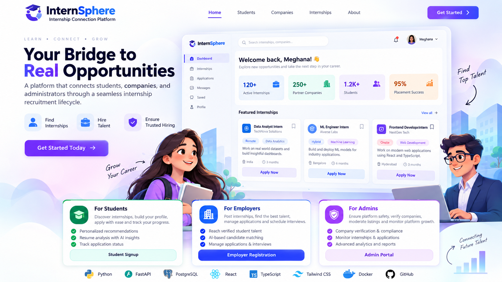

<div align="center">

# 🎓 InternSphere — Internship Connection Platform

**Learn • Connect • Grow**

*A full-stack platform that connects students, companies, and administrators through a seamless internship recruitment lifecycle.*




</div>

---

## 📖 Introduction

**InternSphere** is a role-based web application that manages the complete internship journey — from a company posting an opportunity, to a student applying, interviewing, and getting selected, to an administrator verifying companies and moderating the platform.

It combines a **FastAPI + PostgreSQL** backend with a **React + TypeScript** frontend, and adds real-time chat, interview scheduling, resume parsing, AI-assisted tools for students, MFA, audit logging, and privacy/compliance controls.

## 📑 Table of Contents

- [Key Features](#-key-features)
- [Tech Stack](#-tech-stack)
- [Architecture](#-architecture)
- [Folder Structure](#-folder-structure)
- [Role-Based Access Control](#-role-based-access-control)
- [Recruitment Lifecycle](#-recruitment-lifecycle)
- [Getting Started](#-getting-started)
- [Environment Variables](#-environment-variables)
- [API Reference](#-api-reference)
- [Database Design](#-database-design)
- [Database Migrations](#-database-migrations)
- [Testing & CI](#-testing--ci)
- [Security & Privacy](#-security--privacy)
- [Production Deployment](#-production-deployment)
- [Troubleshooting](#-troubleshooting)
- [Future Improvements](#-future-improvements)
- [Author](#-author)

---

## ✨ Key Features

### 🎓 For Students
- Register, verify email, and build a profile with avatar and resume upload
- **Resume parsing** — upload a PDF and auto-fill profile fields
- Browse, search, filter, and **save** internships
- One-click apply with a cover note; track status in real time
- **AI-assisted tools:** ATS resume score per internship, tailored application pitch, mock interview questions with answer evaluation, and skill quizzes
- Chat with companies, view scheduled interviews, join video interviews
- Review companies and report suspicious listings

### 🏢 For Companies
- Post internships (draft → submit for approval → published → closed)
- Review applicants, **bulk-update statuses**, shortlist, select, or reject
- Schedule interviews and generate offer letters
- Message candidates directly
- Company profile with student reviews and verification badge

### 🛡️ For Administrators
- Verify companies and moderate internship listings
- Suspend / reactivate users and handle user reports
- **Audit logs** for every sensitive admin action
- Analytics dashboard: user growth, application funnel by company, top companies, admin action volume
- **College placement portal** with placement statistics

### 🔐 Platform-Wide
- JWT access + refresh tokens with **Argon2** password hashing
- **TOTP-based MFA**, plus Google sign-in
- Email verification, forgot-password with OTP, and password change
- **WebSocket** real-time chat and video-call signaling
- In-app notifications and a development mailbox (Mailpit)
- Privacy center: data export, account deletion, CCPA opt-out, cookie consent
- Dark mode and mobile-friendly layout with a mobile view simulator

---

## 🧰 Tech Stack

| Layer | Technology | Purpose |
|---|---|---|
| Backend | FastAPI, Python 3.12 | Async REST API, WebSockets |
| ORM | SQLAlchemy 2.0 (async) + asyncpg | Database access |
| Database | PostgreSQL 16 | Primary data store |
| Migrations | Alembic | Versioned schema changes |
| Auth | python-jose (JWT), argon2-cffi, pyotp | Tokens, password hashing, TOTP MFA |
| Resume Handling | pypdf | PDF text extraction / parsing |
| Frontend | React 19, TypeScript, Vite | SPA |
| Styling | Tailwind CSS 4, lucide-react | UI |
| State & Data | Zustand, TanStack Query, Axios | Client state, server state, HTTP |
| Forms | React Hook Form + Zod | Validation |
| Routing | React Router 7 | Role-protected routes |
| Email (dev) | Mailpit | Local SMTP inbox |
| Testing | pytest + httpx, Vitest + Testing Library | Backend / frontend tests |
| DevOps | Docker Compose, Nginx, GitHub Actions | Containers, serving, CI |

---

## 🏗️ Architecture

```
                 ┌──────────────────────────────────────┐
                 │   React + TypeScript (Vite, Nginx)   │
                 │  Student │ Company │ Admin │ Public  │
                 └───────────────┬──────────────────────┘
                                 │  REST (Axios)  /  WebSocket
                                 ▼
┌──────────────────────────────────────────────────────────────────┐
│                        FastAPI  /api/v1                          │
│  Middleware: CORS · Security headers · Rate limiting · Errors    │
│                                                                  │
│  auth · profiles · internships · applications · communication    │
│  ai · admin · analytics · reports · reviews · privacy · ws       │
└───────┬──────────────────┬───────────────────┬───────────────────┘
        │                  │                   │
   PostgreSQL         Private file         Mailpit / SMTP
 (SQLAlchemy async)   storage (resumes,     (verification,
   + Alembic          avatars)              OTP, notifications)
```

---

## 📁 Folder Structure

```
Internship Connection Platform/
├── backend/
│   ├── app/
│   │   ├── api/v1/          # auth, profiles, internships, applications, communication,
│   │   │                    # ai, admin, analytics, reports, reviews, privacy, ws, ...
│   │   ├── core/            # config, database, security, logging
│   │   ├── middleware/      # security headers + rate limiting, error sanitising
│   │   ├── models/          # SQLAlchemy models
│   │   ├── schemas/         # Pydantic request/response models
│   │   ├── services/        # ai, resume_parser, mail, pdf, audit, email_validation
│   │   └── main.py          # FastAPI entry point
│   ├── alembic/versions/    # migrations 0001 – 0007
│   ├── storage/             # private resumes & avatars
│   └── requirements.txt
├── frontend/
│   ├── src/
│   │   ├── pages/           # Landing, Auth, Student, Company, Admin, Communication, Privacy
│   │   ├── components/      # ui, modals, layout, auth, analytics, resume
│   │   ├── store/           # Zustand: auth, theme, viewMode
│   │   ├── api/client.ts    # Axios client
│   │   └── lib/             # WebSocket chat hook, notifications, utils
│   ├── nginx.conf
│   └── Dockerfile
├── doc/                     # docker-compose.yml, docker-compose.prod.yml, Dockerfile
├── .github/workflows/ci.yml # backend + frontend CI
├── .env.example
└── README.md
```

---

## 👥 Role-Based Access Control

Roles are enforced **server-side** through dependency injection (`require_roles(...)`), and mirrored client-side with `ProtectedRoute`.

| Role | Capabilities |
|---|---|
| **Student** | Profile & resume, search/save/apply, track applications, AI tools, chat, interviews, company reviews |
| **Company** | Post & manage internships, review applicants, bulk status updates, schedule interviews, offer letters, chat |
| **Admin** | Verify companies, moderate listings, manage users, handle reports, audit logs, platform analytics |

---

## 🔄 Recruitment Lifecycle

**Internship listing**

```
DRAFT ──► PENDING_APPROVAL ──► PUBLISHED ──► CLOSED
                  └──────────► REJECTED
```

**Application**

```
APPLIED ─► UNDER_REVIEW ─► SHORTLISTED ─► INTERVIEW_SCHEDULED ─► SELECTED
                 │               │                  │
                 └───────────────┴──────────────────┴──► REJECTED
Student may WITHDRAW at any stage before a final decision.
```

---

## 🚀 Getting Started

### Prerequisites
- Python 3.12, Node.js 22+, npm
- Docker Desktop (recommended — provides PostgreSQL and Mailpit)

### Option 1 — Docker (recommended)

```bash
# 1. Configure environment
cp .env.example .env

# 2. Start the full stack
docker compose up --build
```

| Service | URL |
|---|---|
| Frontend | http://localhost:5173 |
| API | http://localhost:8000 |
| Swagger UI | http://localhost:8000/docs |
| Mailpit (emails) | http://localhost:8025 |

The backend container runs `alembic upgrade head` before starting Uvicorn.

> **Port already in use?** Override `BACKEND_PORT`, `FRONTEND_PORT`, `DB_PORT`, and `VITE_API_BASE_URL` before starting Compose, e.g.
> `$env:BACKEND_PORT="8010"; $env:FRONTEND_PORT="5174"; $env:DB_PORT="55432"; $env:VITE_API_BASE_URL="http://localhost:8010/api/v1"`

### Option 2 — Run services directly

**Backend**
```bash
cd backend
python -m venv .venv
.\.venv\Scripts\activate          # Windows  (Linux/macOS: source .venv/bin/activate)
pip install -r requirements.txt
$env:PYTHONPATH = "."             # Linux/macOS: export PYTHONPATH=.
alembic upgrade head
python -m uvicorn app.main:app --reload
```

**Frontend** (in a second terminal)
```bash
cd frontend
npm install
npm run dev
```

---

## 🔑 Environment Variables

| Variable | Required | Description |
|---|---|---|
| `DATABASE_URL` | Yes | Async PostgreSQL URL (`postgresql+asyncpg://...`) |
| `SECRET_KEY` | Yes | JWT signing secret — use a long random string |
| `FRONTEND_URL` | Yes | Allowed frontend origin (CORS, email links) |
| `POSTGRES_DB` / `POSTGRES_USER` / `POSTGRES_PASSWORD` | Docker | Database container credentials |
| `RATE_LIMIT_REQUESTS` | No | Requests per window per client (default `120`) |
| `RATE_LIMIT_WINDOW_SECONDS` | No | Rate-limit window (default `60`) |
| `MAX_RESUME_SIZE_MB` | No | Resume upload limit (default `5`) |
| `RESUME_STORAGE_PATH` | No | Private resume directory |
| `ACCESS_TOKEN_EXPIRE_MINUTES` / `REFRESH_TOKEN_EXPIRE_DAYS` | No | Token lifetimes (default `30` / `7`) |
| `MAIL_SERVER`, `MAIL_PORT`, `MAIL_USERNAME`, `MAIL_PASSWORD`, `MAIL_FROM` | Prod | SMTP settings (Mailpit is used in development) |
| `REQUIRE_EMAIL_VERIFICATION` | No | Enforce email verification (default `true`) |
| `GEMINI_API_KEY` | No | Optional API key for AI features |
| `VITE_API_BASE_URL` | Frontend | Public API base URL, e.g. `http://localhost:8000/api/v1` |

> ⚠️ Never commit `.env`. Replace every placeholder secret before deploying.

### Bootstrap the first administrator

From the `backend` directory, run:

```bash
python -m app.scripts.create_admin you@example.com
```

The command prompts for the password twice and records the bootstrap action in the audit log.
After the first administrator is created, administrators can add accounts from the dashboard.

---

## 📡 API Reference

Interactive docs: **`/docs`** (Swagger) and **`/openapi.json`**. All endpoints are versioned under `/api/v1/` and use `Authorization: Bearer <access_token>`.

### Authentication — `/auth`
| Method | Endpoint | Description |
|---|---|---|
| POST | `/auth/register/student` · `/company` · `/admin` | Register by role |
| POST | `/auth/login` | Login (returns tokens or an MFA challenge) |
| POST | `/auth/google` | Google sign-in |
| POST | `/auth/refresh` · `/auth/logout` | Rotate / revoke tokens |
| GET | `/auth/verify/{token}` | Verify email |
| POST | `/auth/forgot-password` · `/verify-otp` · `/reset-password` | Password recovery |
| POST | `/auth/mfa/setup-totp` · `/verify-totp` · `/enable` · `/disable` | TOTP MFA |
| GET | `/auth/me` | Current user |

### Internships & Applications
| Method | Endpoint | Description |
|---|---|---|
| GET | `/internships` | Search & filter published internships |
| POST / PUT / DELETE | `/internships`, `/internships/{id}` | Company CRUD |
| POST | `/internships/{id}/submit` · `/close` | Submit for approval / close |
| POST / DELETE | `/internships/{id}/save` | Save / unsave |
| POST | `/applications/internships/{id}` | Apply |
| GET | `/applications/mine` · `/company` | Student / company views |
| PATCH | `/applications/{id}/review` · `/shortlist` · `/select` · `/reject` · `/withdraw` | Status transitions |
| POST | `/applications/bulk-status` | Bulk status update |

### Profiles, AI & Communication
| Method | Endpoint | Description |
|---|---|---|
| GET / PUT | `/profiles/student` · `/profiles/company` | Profiles |
| POST | `/profiles/student/resume` · `/resume/parse` | Upload / parse resume |
| POST | `/profiles/avatar` | Upload avatar |
| GET | `/ai/internships/{id}/ats-score` | ATS match score |
| POST | `/ai/internships/{id}/generate-pitch` | Tailored pitch |
| GET / POST | `/ai/internships/{id}/mock-interview` · `/ai/mock-interview/evaluate` | Mock interview |
| GET / POST | `/conversations`, `/conversations/{id}/messages` | Messaging |
| POST / GET | `/applications/{id}/interviews`, `/interviews/my` | Interview scheduling |
| GET / PATCH | `/notifications` | Notifications |
| WS | `/ws/chat/{user_id}` · `/ws/video-signal/{interview_id}` | Real-time chat & video signaling |

### Admin, Analytics & Privacy
| Method | Endpoint | Description |
|---|---|---|
| GET | `/admin/users`, `/admin/companies` | Manage users & companies |
| POST | `/admin/users/{id}/suspend` · `/reactivate` | Account control |
| POST | `/admin/companies/{id}/verification` | Verify a company |
| POST | `/admin/internships/{id}/moderate` | Approve / reject listing |
| GET / PATCH | `/admin/reports` | Handle user reports |
| GET | `/admin/audit-logs` | Paginated audit trail |
| GET | `/analytics/overview` · `/analytics/admin/*` | Dashboards |
| GET | `/institution/placement-stats` | College placement stats |
| GET / POST | `/privacy/export` · `/delete-account` · `/ccpa-opt-out` | Privacy controls |
| GET | `/health` | Health check |

---

## 🗄️ Database Design

Core tables (PostgreSQL, managed by Alembic):

| Table | Purpose |
|---|---|
| `users` | Accounts, role, verification & MFA state |
| `student_profiles` / `company_profiles` | Role-specific profile data |
| `internships` | Listings (title, location, industry, stipend, work mode, skills, deadline, status) |
| `applications` | Student ↔ internship with status and cover note |
| `resumes` | Uploaded resume metadata |
| `saved_internships` | Student bookmarks |
| `company_reviews` | Student reviews of companies |
| `conversations` / `messages` | Chat |
| `interviews` | Scheduled interviews |
| `notifications` | In-app notifications |
| `reports` | User-submitted reports |
| `audit_logs` | Admin action trail |
| `refresh_tokens` / `email_verification_tokens` / `email_messages` | Auth & email support |

---

## 🔁 Database Migrations

Every schema change must be an Alembic migration.

```bash
cd backend
$env:PYTHONPATH = "."
alembic revision --autogenerate -m "describe the schema change"
alembic upgrade head
alembic downgrade -1        # roll back one revision
```

> Never edit a running database schema manually.

---

## 🧪 Testing & CI

**Backend**
```bash
cd backend
$env:PYTHONPATH = "."
python -m pytest tests -q
```

**Frontend**
```bash
cd frontend
npm test
npm run build
npm run lint
```

GitHub Actions (`.github/workflows/ci.yml`) runs on every push and pull request to `main`/`master`:
- **Backend:** pytest against an in-memory async SQLite database
- **Frontend:** Vitest, TypeScript typecheck, and production build

---

## 🔒 Security & Privacy

- **Passwords:** Argon2 hashing
- **Sessions:** short-lived JWT access tokens with rotating refresh tokens
- **MFA:** TOTP authenticator support
- **HTTP hardening:** `X-Content-Type-Options`, `X-Frame-Options`, `Referrer-Policy`, `Permissions-Policy`, and HSTS headers on every response
- **Rate limiting:** per-client request limits (in-memory, per process)
- **Sanitised errors:** internal details are never leaked to clients
- **Private files:** resumes are stored outside the public static path and served only through authenticated endpoints
- **Auditability:** admin actions are recorded in `audit_logs`
- **Privacy controls:** data export, account deletion, CCPA opt-out, and cookie consent

---

## 🌐 Production Deployment

1. Copy `.env.example` to `.env` on the host and **replace every placeholder secret**.
2. Set the public HTTPS API URL (`VITE_API_BASE_URL`, `FRONTEND_URL`).
3. Build and start:

```bash
docker compose -f docker-compose.yml -f docker-compose.prod.yml up --build -d
```

The frontend is served by **Nginx on port 80**; the API binds to loopback port `8000` behind your reverse proxy.

**Production checklist**
- [ ] Strong, random `SECRET_KEY`
- [ ] TLS termination via a managed reverse proxy or load balancer
- [ ] Do **not** expose PostgreSQL publicly
- [ ] Configure a real SMTP / transactional email provider (Mailpit is dev-only)
- [ ] Restrict CORS origins to your domain
- [ ] Use Redis for rate limiting if running multiple instances

---

## 🛠️ Troubleshooting

**Port already in use** — set `BACKEND_PORT`, `FRONTEND_PORT`, or `DB_PORT` (see [Getting Started](#-getting-started)), or on Windows: `netstat -ano | findstr :8000` then `taskkill /PID <PID> /F`.

**Database connection error** — confirm PostgreSQL is running and `DATABASE_URL` matches your setup (host is `db` inside Docker, `localhost` outside).

**Verification emails not arriving** — open Mailpit at http://localhost:8025; in development all mail is captured there.

**Frontend can't reach the API** — check `VITE_API_BASE_URL` and that `FRONTEND_URL` on the backend matches the frontend origin (CORS).

**`ModuleNotFoundError: app`** — set `PYTHONPATH` to the `backend` directory before running Alembic or Uvicorn.

---

## 🔮 Future Improvements

- [ ] Recommendation engine for internship matching and candidate ranking
- [ ] Additional OAuth providers
- [ ] Redis-backed distributed rate limiting and background job queues
- [ ] Production transactional email templates
- [ ] Object storage for resumes with malware scanning and retention policies
- [ ] Advanced search indexing and analytics
- [ ] Calendar provider integration (Google / Outlook)
- [ ] Group chat and multi-company conversations
- [ ] Mobile apps with push notifications
- [ ] CI/CD deployment environments, TLS automation, backups, and observability

---

## 👩‍💻 Author

**Meghana Kamatam**
M.S. Data Science — Sri Venkateswara University, Tirupati (2024 – 2026)

[GitHub](https://github.com/MEGHANARA123456) · [LinkedIn](https://www.linkedin.com/in/meghana-kamatam-084077253)

---

<div align="center">

**Made with ❤️ to connect students with real opportunities.**

⭐ If this project helped you, please give it a star!

</div>
